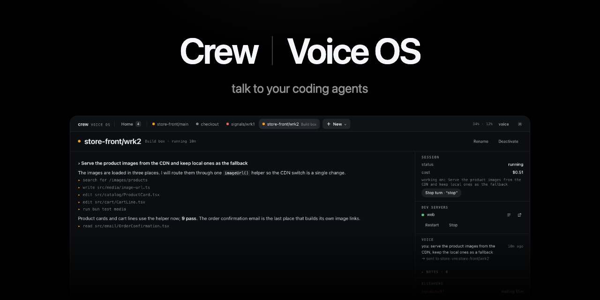
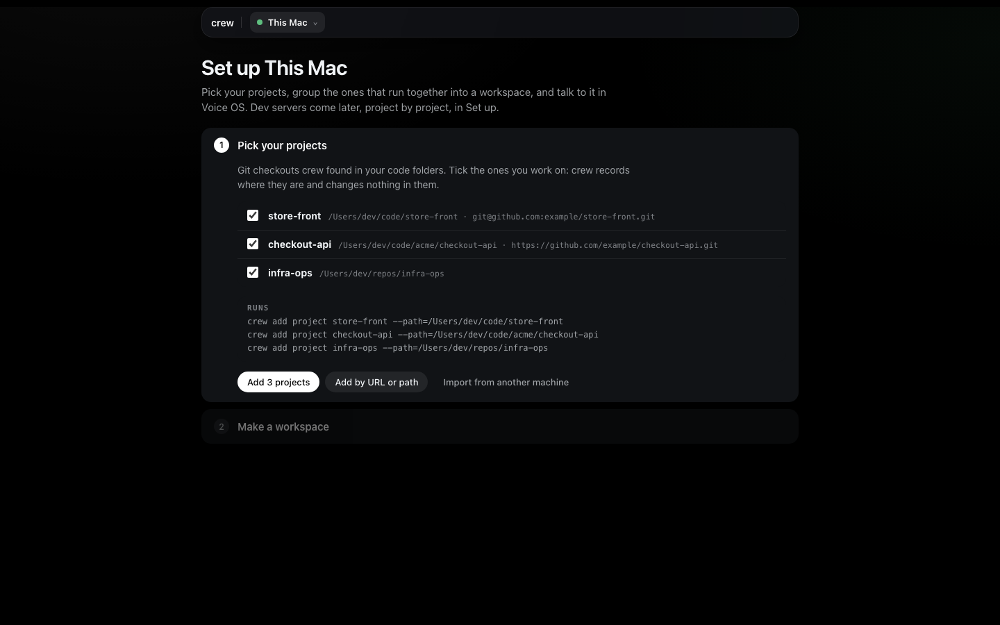
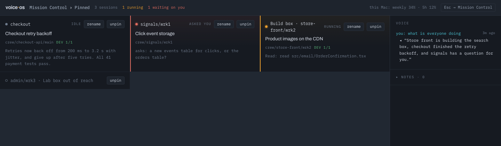

[](https://github.com/FurlanLuka/crew/releases/latest)
[](#what-you-need-and-where-your-data-goes)
[](https://github.com/FurlanLuka/crew/actions/workflows/test.yml)
[](LICENSE)

**Talk to your coding agents, on every machine you own.** Running a few Claudes at once is great
until you become the bottleneck, clicking through terminals to see who's stuck. crew turns that into
a conversation, and it doesn't care where the work runs: your laptop, a big VM, the box under your
desk. "Build box store front, run the e2e suite." "What's waiting on me?" "Yes, but only on staging."

crew is two things that ship together. **Voice OS** is the page you talk to, one Claude Code session
per piece of work, on this machine or any other you can SSH into. **crew** is the command line underneath
that gives each of those sessions its own copy of your stack, with its dev servers running.

[Try it](#try-it) · [Every machine](#every-machine-one-voice) · [What it's like](#what-its-like-to-use) ·
[Where it stands](#where-it-stands) · [Guides](#learn-more) · [Releases](https://github.com/FurlanLuka/crew/releases) · [Website](https://getcrew.sh)

## Try it

```bash
curl -fsSL https://raw.githubusercontent.com/FurlanLuka/crew/main/install.sh | sh
crew
```

That's it. `crew` starts its server and opens a page in your browser (over SSH it prints the link
instead). The first time, it finds the git repos you already have, you tick the ones you work on,
group them into a workspace, and it makes the first working copy of all of them while you watch.
Then you open Voice OS, give it two API keys, hold **Space** and talk.



## Every machine, one voice

Your laptop is the cockpit; the work runs wherever it's fastest. Install crew on a VM or a second
computer, run `crew server remote` there, and add its SSH host in Set up. Its sessions show up next
to yours on the same page, with the same voice and the same alerts ("Build box, signals needs you").
The builds, the dev servers and the Claude sessions stay over there. There are no ports to open: it
rides the SSH you already use.

Close the laptop or lose the Wi-Fi and the sessions over there keep working. What you say waits and
is sent when the link is back, and you hear what finished meanwhile. Update the main and it brings
its remotes along, logs from every machine come back in one query, and any machine can post to your
Discord.



[Other machines](docs/guides/voice-os.md#other-machines) has the details, and
[Running crew on a remote VM](docs/guides/remote-vm.md) sets one up from nothing. When you want to
move your whole setup somewhere new, **Export** saves it to a file and **Import** on the other
machine walks you through bringing it in.

## What it's like to use

Every piece of work gets its own copy of your stack and its own Claude Code session. The one on
your screen is the one you're talking to, so "revert that" or "run the migrations" just goes there.
Name another one and your words go to it instead ("checkout, add a retry"). A small router in the
middle decides where your words go, and it's strict about one thing: anything about the actual work
goes to the session in your words. It never answers for the session or guesses what you meant.

The sessions mostly get on with it. When one needs you (a permission, a plan to approve, a question
with options) you hear it and answer out loud, "yes" or "the second one" or "no, use a new branch",
without switching to it. Sessions you aren't looking at don't read you their whole essay. You hear
"checkout is done" or "checkout needs you" once it's quiet, and "status update" gets you a short
spoken recap of where everything is.

Home shows what's running and what waits on you, and **New** starts anything: a worktree, or a plain
Claude conversation in any folder when the work isn't a worktree at all. You can listen the way that
fits where you are: hold Space to talk, say "Voice OS, …" when you want it, go fully hands-free, or
mute voice with one click and just type. Away from the desk, Voice OS can join a Discord voice
channel and you talk to it from your phone.

The [Voice OS guide](docs/guides/voice-os.md) has the full walkthrough, and the
[commands page](docs/guides/voice-os-commands.md) lists everything you can say.

## Setting things up

All the configuration lives on crew's page under **Set up**: projects, their dev servers, how they
point at each other, workspaces, worktrees and machines. Every form shows the exact command it will
run, and there's a Claude on every machine you can just ask instead:

> "Add the store api and store app repos from ~/code with their dev servers, wire the store app's
> API URL to the store API, and make a store front workspace with both."

It does the whole thing, checks every server actually starts, and shows a line for each command it
recorded. [The Set up guide](docs/guides/setup.md) goes through every page.

## How it works underneath

A **workspace** is the set of repos a feature touches. A **worktree** is one working copy of all of
them: a git worktree per repo, dev servers on ports that stay the same for that copy, and env vars
that point the services at each other instead of at whatever happens to be running on `:3000`.

```
~/.crew/workspaces/store-front/
  main/  store-api  store-app  checkout-api   ← ports 54480…
  wrk1/  store-api  store-app  checkout-api   ← ports 54494…, its own branches
```

When crew makes a worktree it proves it works before you touch it: checkout, install, servers up.
When something breaks, the failure is recorded with its evidence instead of scrolling past in a
terminal you closed, and the Claude in that worktree knows how to read it. If you'd rather type,
everything the page and the Claudes do is a plain command that prints rows or `--json`:

```bash
crew add project store-api git@github.com:example/store-api.git
crew add project store-app git@github.com:example/store-app.git
crew dev add store-api --name=store-api --port=3000 --cmd="npm run dev"
crew dev add store-app --name=store-app --port=3001 --cmd="npm run dev"
crew add binding store-app --scan --apply             # which env vars point at store-api
crew add workspace store-front store-api store-app    # checkout, install, servers checked
crew add worktree store-front/wrk1                    # a second copy of everything
crew dev start store-front/wrk1                       # its servers, on its own ports
```

Claude Code also gets a plugin with a reference skill, a `crew` agent and guided setup:
`/plugin marketplace add FurlanLuka/crew`, then `/plugin install crew@crew`. It also draws the
[crew pane](docs/guides/crew-pane.md) in every session that sits in a worktree, terminal or Claude
Desktop: the servers, their logs, a restart per server and the failures, a click away.

## Where it stands

I build crew with crew, every day. A lot of this repo's pull requests, including the one with this
README, came from sessions I was talking to in Voice OS. It's young and it moves fast, with new
releases often, so expect things to change and tell me when they break.

What it does today is what you see above, on macOS and Linux, with Claude Code as the agent. The
command line works with any agent that has a shell, but the voice side drives Claude Code sessions
only. Every change goes through around 3,600 unit tests, 150 browser tests against the real page, and
crew's own Go tests before it merges, and the [release notes](https://github.com/FurlanLuka/crew/releases)
say what changed and why. If something's missing for the way you work, [open an issue](https://github.com/FurlanLuka/crew/issues).

## What you need, and where your data goes

crew runs on macOS and Linux and needs git and tmux. If you're missing something, `crew doctor`
tells you and `crew doctor --install` installs it for you (Homebrew or `xcode-select` on a Mac,
apt-get, dnf or pacman on Linux). Voice OS's Linux builds need glibc, so on Alpine and other musl
systems crew works but Voice OS doesn't. Every session runs on your own
[Claude Code](https://code.claude.com/docs) login, and `crew doctor --install` can set that up too.

For voice you need two API keys. The Anthropic one pays for the router and the short spoken
summaries; a spoken turn costs the router about a third of a cent. The [Soniox](https://soniox.com)
one is for speech in and out, billed by audio time ([pricing](https://soniox.com/pricing)). Both
are checked before they're saved and kept on your machine, readable only by you.

Your voice and the text of spoken replies go to Soniox, to become text and speech. What you say and
short excerpts of what sessions write go to Anthropic on your key, for routing and summaries. The
sessions themselves talk to Anthropic through Claude Code like they always do. Everything else stays
on your machine: the keys, your notes and the voice log. Voice OS never keeps recordings of your
voice.

## Learn more

- [Set up](docs/guides/setup.md): the page for projects, workspaces, worktrees and machines
- [Voice OS](docs/guides/voice-os.md): from two repos to a working feature, and what you can say
- [Voice OS commands](docs/guides/voice-os-commands.md): everything the router knows, with things to say
- [Getting set up](docs/guides/getting-set-up.md): the same setup as commands
- [How crew works](docs/concepts.md): projects, bindings, checks, failures, other devices, moving machines
- [Commands](docs/commands.md): every command and its output
- [Running crew on a remote VM](docs/guides/remote-vm.md)
- [Voice OS internals](voiceos/README.md): the router, keys, development
- [Contributing](CONTRIBUTING.md) · [Security](SECURITY.md) · [Code of conduct](CODE_OF_CONDUCT.md)

`crew update` keeps crew and Voice OS on the latest release (`crew update --check` only asks). A
running server keeps its version until `crew server restart`.

**License:** [MIT](LICENSE).
