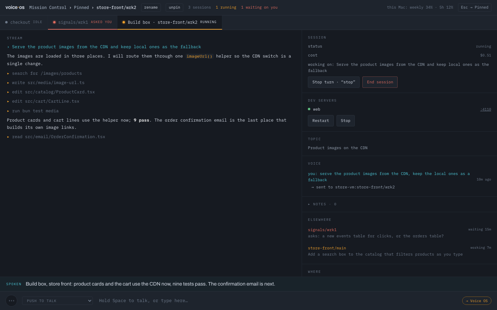

# crew

[](https://github.com/FurlanLuka/crew/actions/workflows/test.yml)
[](https://github.com/FurlanLuka/crew/actions/workflows/voiceos.yml)
[](LICENSE)

**Talk to your coding agents.** Every feature you're working on gets its own copy of your stack and
its own Claude — and you run them all by voice: "tell checkout to run the tests", "what's waiting
on me?", "yes, but only on staging".



## Try it

```bash
curl -fsSL https://raw.githubusercontent.com/FurlanLuka/crew/main/install.sh | sh
crew voice
```

The first `crew voice` checks you have tmux and Claude Code, downloads Voice OS, and asks for an
Anthropic key and a Soniox key — checked before they're saved, stored only on this machine. Then it
opens in your browser: hold **Space** and talk.

### What you need

- **macOS or Linux, with git and tmux.** `crew doctor` says what is missing, and `crew doctor
  --install` installs it (Homebrew or `xcode-select` on a Mac; apt-get, dnf or pacman on Linux).
  Voice OS's Linux builds (x64 and arm64) need glibc, so Alpine and other musl systems can run
  crew but not Voice OS.
- **[Claude Code](https://code.claude.com/docs)**, signed in. Every session runs on your own Claude
  Code login; `crew doctor --install` offers to install it too.
- **An Anthropic API key**, for the router that decides where your words go and for the short
  spoken summaries. A spoken turn costs the router about a third of a cent.
- **A [Soniox](https://soniox.com) API key**, for speech in and out. Soniox bills by audio time
  ([pricing](https://soniox.com/pricing)).

**Where your data goes:**
- **Your voice, and the text of spoken replies,** go to Soniox: your voice to become text, the
  replies to become speech.
- **What you say, and short excerpts of what sessions write**, go to Anthropic for routing and
  summaries, on your API key.
- **The sessions themselves** talk to Anthropic through Claude Code, as they always do.
- **Everything else stays on your machine:** the keys (readable by you alone), your notes, and the
  voice log. Voice OS keeps no recordings of your voice.

## Set up by talking

Voice OS has a **setup** session that runs crew for you. Point it at your repos — folders you
already have, or git URLs — and say what you want:

> "Add the store api and store app repos from ~/code to crew with their dev servers, wire the
> store app's API URL to the store API, and make a store front workspace with both."

It registers each project, finds how its dev server runs, points the services at each other,
installs a fresh copy and checks every server starts. The new worktree appears on its own; then
"open store front main", "start the dev servers", and ask for whatever you're building.
[The walkthrough](docs/guides/voice-os.md#from-two-repos-to-a-working-feature) shows every step.

## What it does

- **One session per piece of work.** Each worktree has its own Claude Code session; Voice OS keeps
  them running and shows them side by side.
- **Speak to the one on screen, or any of them by name.** "Revert that", "checkout, run the
  migrations", "open the ranking one". A small router decides where your words go — and anything
  about the work goes to the session, in your words, instead of being guessed at.
- **Listen the way that suits the room.** Hold Space to talk, say "Voice OS, …" when you want it,
  or go hands-free and just talk.
- **Answer without switching.** Permissions, plans and questions come to you by voice: "yes", "the second one",
  "no, use a new branch".
- **Sessions that get on with it.** They run in Claude Code's auto mode, so routine steps don't
  wait on you. When a safety check blocks something, you hear why and can allow that one call —
  "allow it" — and nothing more.
- **Hear what matters, not everything.** Sessions you aren't looking at say "checkout is done" or
  "checkout needs you: the backoff cap"; the full message plays when you switch there.
- **Pin what you're juggling, name it what you call it.** Pinned gathers the sessions you care
  about, from every machine, in one view ("pin this", "go to pinned"). Rename a session ("call
  this search fix") and that name shows everywhere and works by voice.
- **Your dev servers, watched.** When one dies after a start, Voice OS tells you and offers to have
  that worktree's Claude fix it — "yes" hands it the failure with its logs.
- **See what they make.** A screenshot or chart a session takes shows right in its page, and the
  docs and artifacts it writes (Claude Docs, Google Docs, Notion) become cards — "open the doc"
  opens one in the browser you're using, phone included.
- **Notes as you think.** "Note: try a tone per session" — kept per workspace.
- **Sessions on other machines too.** A VM or a second computer runs its own worktrees and
  sessions; your Mac drives them over SSH with the same voice and page — a card per machine on
  Mission Control, alerts from all of them, and a dropped link that never stops the work there.
  [Other machines](docs/guides/voice-os.md#other-machines) has the three steps.

[The Voice OS guide](docs/guides/voice-os.md) has what you can say, from real use.

## How it works: crew

Voice OS is the part you talk to; crew is the bones underneath. It gives every piece of work a
real, isolated copy of your stack — with its dev servers running and the agent inside knowing how to
reach them.

A **workspace** groups the repos a feature touches. A **worktree** is one working copy of all of
them: a git worktree per repo, dev servers on stable ports, and env vars that point the services at
*each other* instead of at whatever happens to run on `:3000`.

```
~/.crew/workspaces/store-front/
  main/  store-api  store-app  checkout-api   ← ports 54480…
  wrk1/  store-api  store-app  checkout-api   ← ports 54494…, its own branches
```

**Dev servers that stay honest.** crew starts every server of a worktree on ports it keeps for that
copy, then checks them: which one died, which runs but never listens, with the last lines of its
log. A new worktree is proven the same way before you touch it — checkout, install, servers up —
and a failure is recorded with its evidence instead of scrolling past.

**Agents that debug on their own.** The Claude in a worktree is told where it stands and how to
reach everything: `crew dev logs` for any server's output, `crew dev check` for what's up, `crew
run` to run tests or scripts with the same URLs the servers got, and `crew fix` to pick up a
recorded failure with all its evidence. No hunting for which terminal ran what.

Prefer typing? The setup session runs these same commands, and you can too:

```bash
crew add project store-api git@github.com:example/store-api.git
crew add project store-app git@github.com:example/store-app.git
crew dev add store-api --name=store-api --port=3000 --cmd="npm run dev"
crew dev add store-app --name=store-app --port=3001 --cmd="npm run dev"
crew add binding store-app --scan --apply             # which env vars point at store-api
crew add workspace store-front store-api store-app    # checkout, install, servers checked
crew add worktree store-front/wrk1                    # a second copy of everything
crew dev start store-front/wrk1                       # its servers, on its own ports
```

## Without voice

Everything is a plain command that prints rows or `--json`, so any agent with a shell can drive
crew; `crew workspace` and `crew project` open a TUI. Claude Code gets a plugin with the reference
skill, a `crew` agent and guided setup:

```
/plugin marketplace add FurlanLuka/crew
/plugin install crew@crew
```

## Learn more

- [Getting set up](docs/guides/getting-set-up.md) — a workspace, its projects, a second worktree
- [Voice OS](docs/guides/voice-os.md) — a walkthrough from two repos to a working feature, and what you can say
- [Voice OS commands](docs/guides/voice-os-commands.md) — every command the kernel knows, with things to say
- [How crew works](docs/concepts.md) — projects, bindings, checks, failures, other devices, moving machines
- [Commands](docs/commands.md) — every command and its output
- [Running crew on a remote VM](docs/guides/remote-vm.md)
- [Voice OS internals](voiceos/README.md) — the router, keys, development
- [What's new in 5.0](docs/releases/v5.0.0.md)
- [Contributing](CONTRIBUTING.md) · [Security](SECURITY.md) · [Code of conduct](CODE_OF_CONDUCT.md)

`crew update` keeps crew — and Voice OS, once installed — on the latest release.

**License:** [Functional Source License 1.1, MIT future](LICENSE) (FSL-1.1-MIT). You can use it,
change it, run it at work and redistribute it for any purpose except a competing use: offering it,
or something built from it, in a commercial product or service that competes with crew. Each
release becomes plain MIT two years after it ships. Releases made before the license change stay
MIT.
