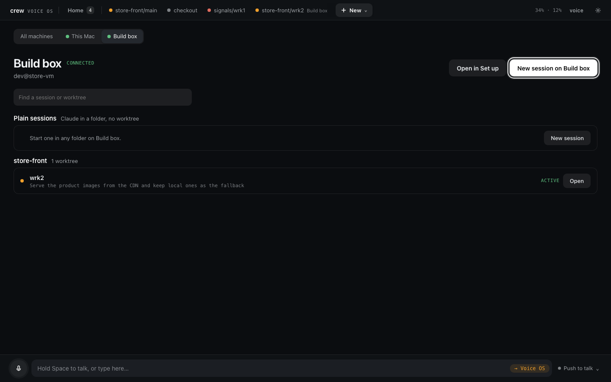

# Running crew on a remote VM

crew runs the same on a Linux VM as on your laptop: worktrees, dev servers on stable ports, Claude
Code (or any agent with a shell) in each worktree, and your editor attached over SSH. This guide
sets one up from nothing and, optionally, lets the Voice OS on your laptop drive the VM's sessions.

The examples call the VM `store-vm`. Any machine you can reach over SSH works; Google Cloud is
used below as one example of a VM behind a tunnel.

---

## 1. SSH access

Everything later — your editor, `crew code`, Voice OS — reaches the VM through one SSH host
alias, so set that up first. On your **laptop**, make a key if you don't have one:

```bash
ssh-keygen -t ed25519 -f ~/.ssh/store_vm
```

Put the public key on the VM however your provider does it (an `authorized_keys` entry, a cloud
console, instance metadata), then give the VM an alias in `~/.ssh/config`:

```
Host store-vm
  HostName <the VM's address>
  User <your user on the VM>
  IdentityFile ~/.ssh/store_vm
```

Check it:

```bash
ssh store-vm
```

### Example: a Google Cloud VM through IAP

A GCP VM without a public IP is reached through an IAP tunnel. Add the key to the instance, then
let `gcloud` carry the connection:

```bash
gcloud compute instances add-metadata <instance> \
  --metadata=ssh-keys="<your user>:$(cat ~/.ssh/store_vm.pub)" \
  --project=<project> --zone=<zone>
```

This replaces the instance's `ssh-keys` list; if it already has keys, include them too, or use
OS Login instead.

```
Host store-vm
  HostName <instance>
  User <your user on the VM>
  IdentityFile ~/.ssh/store_vm
  ProxyCommand /path/to/gcloud compute start-iap-tunnel %h %p --listen-on-stdin --project=<project> --zone=<zone>
```

Two things matter if Voice OS will connect through this alias (section 7):

- **Nothing may prompt.** Voice OS runs `ssh -o BatchMode=yes`, so there is no terminal for a
  password, a key passphrase or a gcloud login. Keep `gcloud auth login` current, load a
  passphrase-protected key into `ssh-agent`, and test the way Voice OS will connect:
  `ssh -o BatchMode=yes store-vm true` must print nothing and exit 0.
- **Use the full path to `gcloud`** (`command -v gcloud` prints it). Voice OS runs in tmux, and
  the tmux server's `PATH` may not be your shell's.

---

## 2. Install crew

On the **VM**:

```bash
curl -fsSL https://raw.githubusercontent.com/FurlanLuka/crew/main/install.sh | sh
echo 'export PATH="$HOME/.local/bin:$PATH"' >> ~/.bashrc && source ~/.bashrc
```

Then install what crew relies on — git and tmux, and Claude Code for the sessions:

```bash
crew doctor --install                        # asks before each install
crew doctor --install --yes --with-claude    # the same without questions (a script, cloud-init)
crew doctor                                  # what is there now
```

Sign in to Claude Code, and give the VM access to your repos (an SSH key registered with your git
host, or `gh auth login` if you use GitHub's CLI):

```bash
claude auth login
```

Keep crew current with `crew update` on the VM, the same as on your laptop.

---

## 3. A checkout you already have

crew clones each project itself when you give it a URL. One repo in this guide is adopted from a
checkout that is already on disk, to show both forms:

```bash
git clone git@github.com:example/store-app.git ~/projects/store-app
```

Use your own repos. crew installs each worktree's dependencies itself (mise, then the lockfile's
package manager or the project's setup command), so there is no `npm install` here.

---

## 4. Set up crew

Everything is a command. `crew` on the VM starts crew's server and prints its link (over SSH it
prints the proxy link whenever crew's proxy reaches the server — a `domain` you set, or the
automatic `<server_ip>.nip.io` — else the `ssh -L` tunnel line to run on your laptop) — its Set
up page is the same steps as forms.

### Register projects and their dev servers

```bash
crew add project store-api git@github.com:example/store-api.git   # cloned into ~/.crew/projects/store-api
crew add project store-app --path=~/projects/store-app            # or adopt a checkout already on the VM
crew dev add store-api --name=store-api --port=3000 --cmd="npm run dev"
crew dev add store-app --name=store-app --port=3001 --cmd="npm run dev"
crew check project store-api --wait                               # proves a fresh checkout installs and runs
```

A project is its git remote; a bare path is refused. `crew add project --scan` lists the
checkouts already on the VM; on crew's page, Set up starts from that list and walks the same
steps one form at a time.

The `--port` is a reference: crew allocates a real port per worktree and runs the command with
`PORT=<n>` set, so the dev command must bind `$PORT`.

### Bindings

Tell crew which env vars point at siblings, so every worktree gets the right URLs:

```bash
crew add binding store-app --scan          # proposes from store-app's .env
crew add binding store-app --scan --apply  # adds the unambiguous ones
```

### Create a workspace

```bash
crew add workspace store-front store-api store-app
```

That records the members and returns at once: one runner per project checks it out, installs it
and smoke-starts its servers in the background. `crew setup status store-front/main --wait`
watches them; `crew ls worktrees` lists what you have, and a recorded failure shows in the row.

### Configure settings

```bash
crew config set ssh_host store-vm            # the alias your laptop uses, for crew code
crew config show
```

`server_ip` is auto-detected; set it with `crew config set server_ip <ip>` if the VM has several
interfaces.

---

## 5. Reaching the dev servers

With `crew dev start <ref> --proxy`, every dev server is also served at
`http://<server>--<workspace>--<worktree>.<vm-ip>.nip.io` through one reverse proxy on port 80.
That works as long as your laptop can reach the VM's IP (same network, a VPN, Tailscale —
`crew config set server_ip $(tailscale ip -4)`).

When it can't, or when an app only accepts sign-ins from known domains (OAuth redirect lists,
auth providers that refuse `nip.io`), put a stable wildcard domain in front of the proxy — for
example a tunnel such as ngrok with a reserved `*.store-vm.example.dev` domain:

```bash
tmux new -s tunnel
ngrok http 80 --url=store-vm.example.dev
# Ctrl+B D to detach
```

Then point crew at it; the proxy picks the domain up on the next `crew dev start … --proxy`:

```bash
crew config set domain store-vm.example.dev
```

Add that domain wherever your app's auth provider lists allowed origins.

---

## 6. Using crew

```bash
crew dev start store-front/main --proxy      # servers on stable ports, proxy hostnames
crew dev check store-front/main --wait       # which server died or never listened
crew dev logs store-front/main store-api --lines=50
crew dev stop store-front/main
```

`crew dev start` prints the URLs and any `!` lines: an env value pointing at the wrong port is
caught there, before it fails at runtime.

### Launch Claude

```bash
crew claude store-front/main     # Claude Code in this terminal, in the worktree
crew edit store-front/main       # your editor with the prompt and Claude wired
crew launch store-front/main     # the launch page (TUI): launch rows, servers read-only, logs
```

Claude opens with the orientation prompt: the projects, their paths, and a `## crew` section that
tells it to drive the servers through crew.

### Open in Cursor or VS Code from your laptop

```bash
crew code store-front/main
```

Prints links that open the worktree over Remote-SSH, using `ssh_host`. You can also connect by
hand: `Remote-SSH: Connect to Host` → `store-vm`.

### A second working copy

```bash
crew add worktree store-front/wrk2 --pull    # own branches, own ports, own .env
crew claude store-front/wrk2
```

### When something fails

`crew ls worktrees` shows what was recorded (`install failed: …`, `server died: …`, `server not
listening: …`). `crew fix <ref>` opens Claude with the evidence; `crew fix <ref> --print` prints
it; `crew verify <ref>` finishes what is missing and re-checks.

---

## 7. Optional: drive it from Voice OS on your laptop

Talk to the VM's sessions from the Voice OS on your laptop instead of SSH-ing in. On the **VM**,
make it a remote:

```bash
crew server remote          # checks tmux and Claude Code, installs Voice OS, starts the daemon
crew server remote status   # up, its version, busy or idle, its socket
```

The daemon runs in tmux and keeps the sessions going whether or not a laptop is connected. It
runs no voice and needs no API keys: speech and routing happen on your laptop.

On your **laptop**, add the machine (or use **Add machine** in Set up):

```bash
crew server machines add store-vm --name="Build box"
crew server machines        # its status as the running server sees it
```

Voice OS connects with the same SSH alias as section 1, never with a password prompt — see the
BatchMode note there. The VM's worktrees then show on its own page in Voice OS (a card on Home, or
**New → Build box**), and Set up's machine picker sets the VM up from your laptop; see
[Other machines](voice-os.md#other-machines).



**Updating.** Run `crew update` on the VM as well as on your laptop. The VM's daemon moves to the
new release on the next connection, at once: a session at work is cut off and resumes on the new release.

---

## Optional: the Claude Code plugin

On your laptop, in Claude Code:

```
/plugin marketplace add FurlanLuka/crew
/plugin install crew@crew
```

Claude can then drive crew for you; see [the Claude Code plugin](../concepts.md#claude-code-plugin).
