# Set up

**Set up** is the half of crew's page where crew is configured: projects, workspaces, worktrees,
machines and crew's own settings. Every form runs a `crew` command, and shows it under the form
before you press anything, so nothing here is out of reach of the terminal (or of an agent). The
other half is [Voice OS](voice-os.md), where you talk to the sessions.

The examples use a store: `store-front` (the web app), `store-api`, `checkout-api` and `signals`.
Use your own repos.

## Contents

- [Opening it](#opening-it)
- [The board](#the-board)
- [A project](#a-project)
- [Checking a project](#checking-a-project)
- [Workspaces](#workspaces)
- [Worktrees](#worktrees)
- [A new worktree](#a-new-worktree)
- [Setup with Claude](#setup-with-claude)
- [Machines](#machines)
- [Settings](#settings)
- [Moving to another machine](#moving-to-another-machine)
- [First run](#first-run)
- [On a phone](#on-a-phone)

## Opening it

```bash
crew
```

Bare `crew` starts crew's server if it is not running and opens the page in your browser. With no
terminal, over SSH or with `--no-open`, it prints the link instead. The page opens on **Home**:

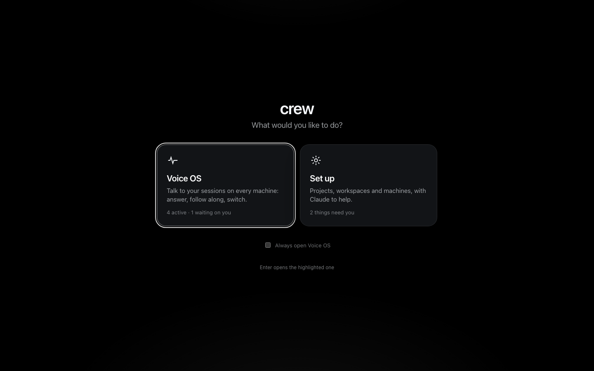

Pick **Set up**. Each card says what is waiting there ("2 things need you" is the board's problems
strip). Enter opens the highlighted one. Ticking **Always open Voice OS** skips Home when you open
the page fresh, once there is a worktree to talk to (on a first run Home is the [first run](#first-run));
the crew mark at the top left always brings you back to it, and Voice OS's settings turn it off.

Set up shows one machine at a time. The bar along the top has the crew mark, the **machine
picker** (This Mac, and any [other machines](#machines) — one with something broken shows it when
you open the menu) and the breadcrumbs of where you are. **Esc** goes up one breadcrumb.

## The board

The board is the machine's front page: what it has, and what needs you.

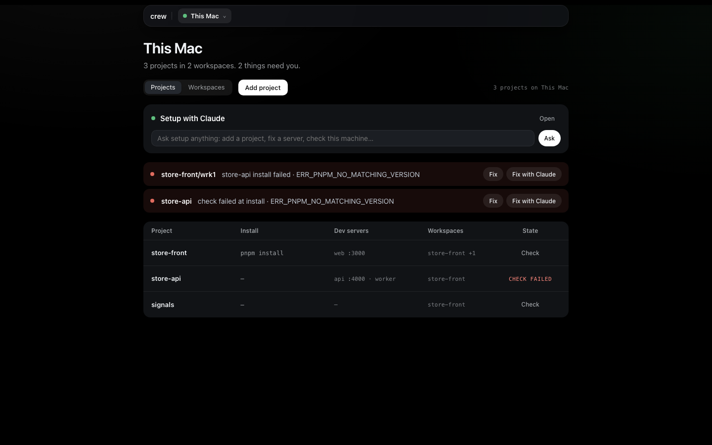

From the top:

- **Setup with Claude** — a box to ask the machine's Claude anything about setting it up. **Open**
  goes to the [whole conversation](#setup-with-claude).
- **The problems strip** — one row per thing that needs you: a worktree whose install or servers
  failed, or a project whose check failed. Each row has **Fix**
  (the page where the failure is shown, with its evidence) and **Fix with Claude** (the same
  failure handed to Setup with Claude). Nothing broken, no strip.
- **Projects** and **Workspaces** — two tabs over one table.

**Projects** lists every project on the machine, one line each: its install, its dev servers with
their ports, the workspaces it is in, and its state — **Check** (never checked), check failed, or
ready. A long cell ends in "…" and shows the whole of it on hover; a list says its first entries and
how many more ("web :3000 · api :4000 +2", "store-front +1"). A click anywhere on a row opens the
project; its own buttons do only their own thing. **Add project** takes a git URL (crew clones it)
or a folder you already have (crew records where it is and changes nothing in it); the form shows
`crew add project …` as you type.

A project with no dev servers (a library, infra) is a whole project: nothing flags it, and its
sessions read, change and test its code like any other.

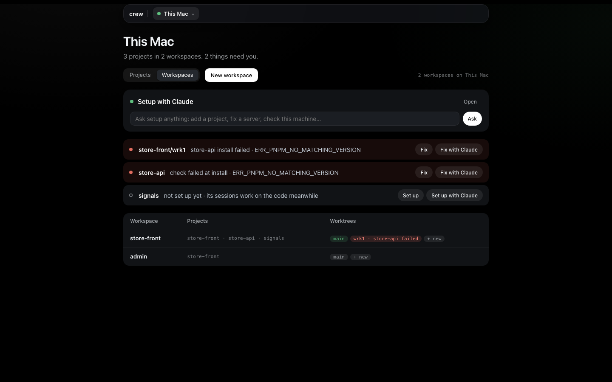

**Workspaces** lists each workspace with its projects and its worktrees as chips: green when
ready, red with what failed, "+N" for the rest, and **+ new** to make another. **New workspace**
opens the form.

## A project

Click a project for its page: what crew recorded, one line per fact — its install and env
command, each dev server, each Environment variable, the workspaces it is in, where its code comes
from and where it is. A long value ends in "…" with the whole of it on hover.

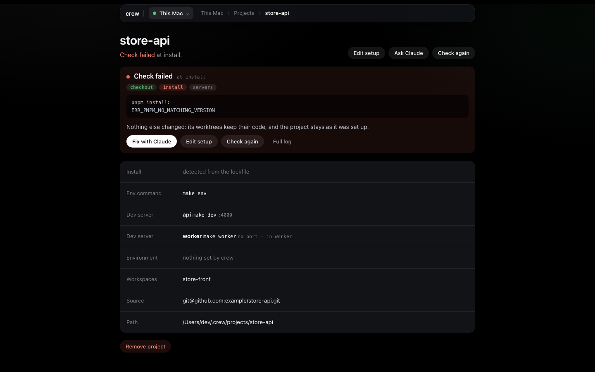

When its last check failed, the page opens on that: the step it stopped at (checkout, install or
servers), the end of the log, and what it means ("its worktrees keep their code, and the project
stays as it was set up"). **Fix with Claude**, **Edit setup**, **Check again** and **Full log**
sit under it.

**Remove project** at the bottom takes it out of crew. It asks first, and says what goes with it:
a clone crew made goes to crew's trash, a folder you added is never touched.

### Edit setup

**Edit setup** opens the project's form:

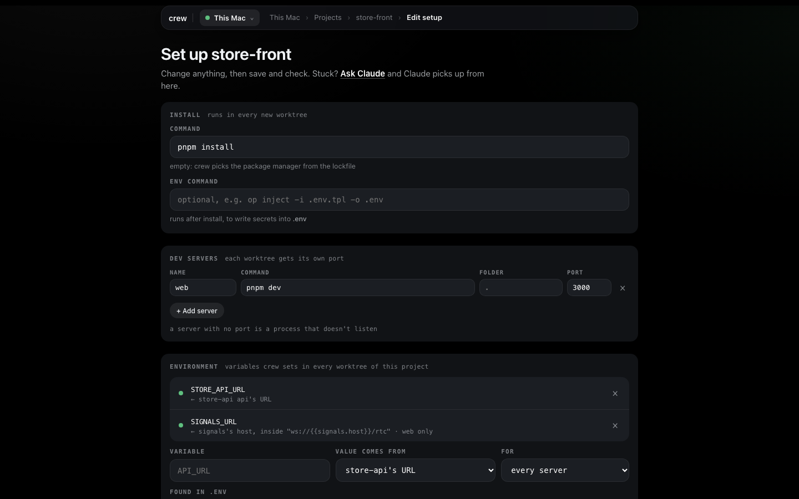

- **Install** runs in every new worktree. Empty means crew picks the package manager from the
  lockfile. The **env command** runs after it, for env files that come from a vault
  (`op inject -i .env.tpl -o .env`).
- **Dev servers** — a name, the command, the folder it runs in and a port. The command must listen
  on `$PORT`: every worktree gets its own port, and the one here is only a reference. A server with
  no port is a process that doesn't listen (a worker, a watcher). Renaming a server keeps its
  environment.
- **Environment** — variables crew sets in every worktree of the project, pointing it at the other
  projects of the same worktree. Pick the variable, where its value comes from (`store-api's URL`,
  its host, its port, or your own text with those inside it, like `ws://{{signals.host}}/rtc`) and
  which server gets it. Before you save, each line shows the value it would get in every worktree;
  one that can't resolve says why. In the terminal, `crew add binding <project> --scan` proposes
  the `localhost` lines of the project's `.env` files.

Save records it; the command line under the form is what runs. Stuck? **Ask Claude** sends the
form's project to Setup with Claude, which picks up from there. In the terminal, the Environment
is `crew add binding`.

## Checking a project

**Check** (on the board) or **Check again** (on the page) proves the project works from nothing: a
clean checkout, the install, then every dev server has to answer. The check page follows it step
by step while it runs. A pass is a green line on the project; a failure stays on the project page
with its evidence until you fix it and check again. It touches nothing you work in — the check has
its own scratch checkout, cleared once it passes. Terminal: `crew check project store-api --wait`.

## Workspaces

A workspace is the projects you work on together. Each worktree gets a copy of every one, wired to
each other.

**New workspace** asks for a name and the projects. Each project is in a worktree of its own
(**worktree**, the default) or **direct** — its one checkout, shared, for a project you never
branch. One that can't be direct (it is already direct in another workspace, or has worktrees)
says why when you save. **How they connect** lists which Environment lines between the ticked
projects resolve. Creating it also makes its first worktree, **main**, with every server tried.

A workspace's page lists its projects and its worktrees. **Add or take out** projects there:
every worktree gets the change. Taking one out, or removing the workspace, opens a confirm that
says, per checkout, what would go — uncommitted files, commits that are not on the base branch and
the space on disk — before anything is removed.

## Worktrees

A worktree's page is one working copy of the workspace:

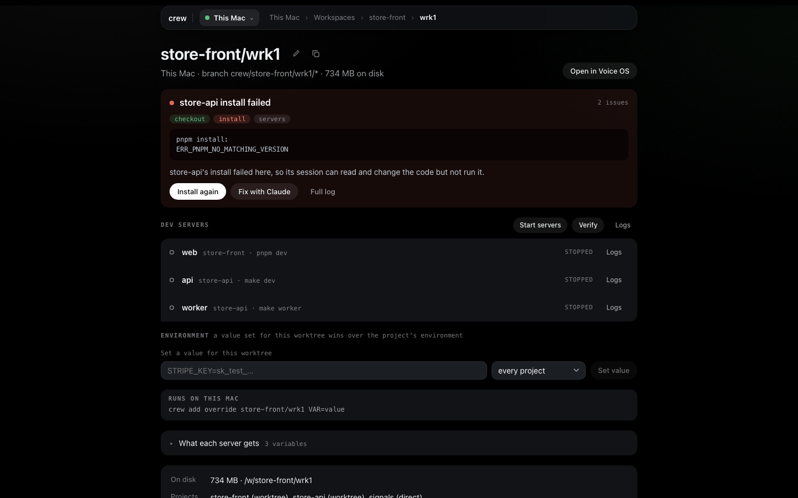

- Its name, with **Rename** and **Duplicate** as small icons beside it, and **Open in Voice OS** on
  the right.
- A failure is shown first, the same way as on a project: the step, the end of the log, what it
  means ("its session can read and change the code but not run it"), **Install again**, **Fix
  with Claude**, **Full log**.
- **Dev servers** — each with its state and, while it runs, its URL. The section's own row has
  **Start servers** (or **Stop servers** and **Restart**), **Verify** (check that each server comes
  up again) and **Logs** (the servers' and the runners' output).
- **Environment** — the values set for this worktree only, for every project or one of them
  (`STRIPE_KEY=sk_test_…`). Each says **set for this worktree** and what it replaces ("instead of
  store-front's value: store-api api's URL"): it wins over the project's Environment, scoped values
  included. **Set a value for this worktree** adds one. **What each server gets** opens to show the
  final set, server by server. Terminal: `crew add override`.
- **On disk** — its size and folder, and how each project is in it.

**Rename** moves its checkouts and renames crew's branches; it is refused while its servers run or
setup is busy with it. **Duplicate** makes fresh checkouts of the same projects on new ports, with
the values set for this worktree copied across. **Remove worktree** shows what would go first, like
a workspace; removing a workspace's last worktree removes the workspace too.

## A new worktree

**+ new** on a workspace, or **New worktree** on its page:

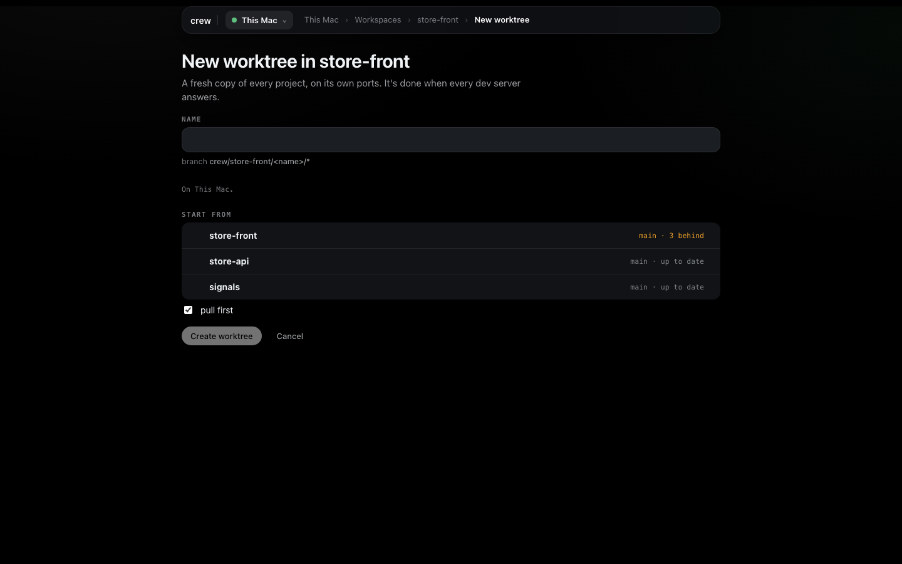

**Start from** shows each project's base branch and how far it is behind origin. **Pull first**
fast-forwards the bases before branching (it never touches a branch you have checked out). Each
project gets a `crew/store-front/<name>/<project>` branch.

**Create worktree** then follows crew's runners, one line per step of each project: checkout,
install, servers tried. It is done when every dev server answers. A project that fails stops there
with its error and **Fix with Claude**; the others keep what they have, and **Carry on** takes you
to the worktree anyway.

## Setup with Claude

Each machine has its own Claude for setting up: a Claude Code session in your home folder with the
crew CLI, always on, one conversation.

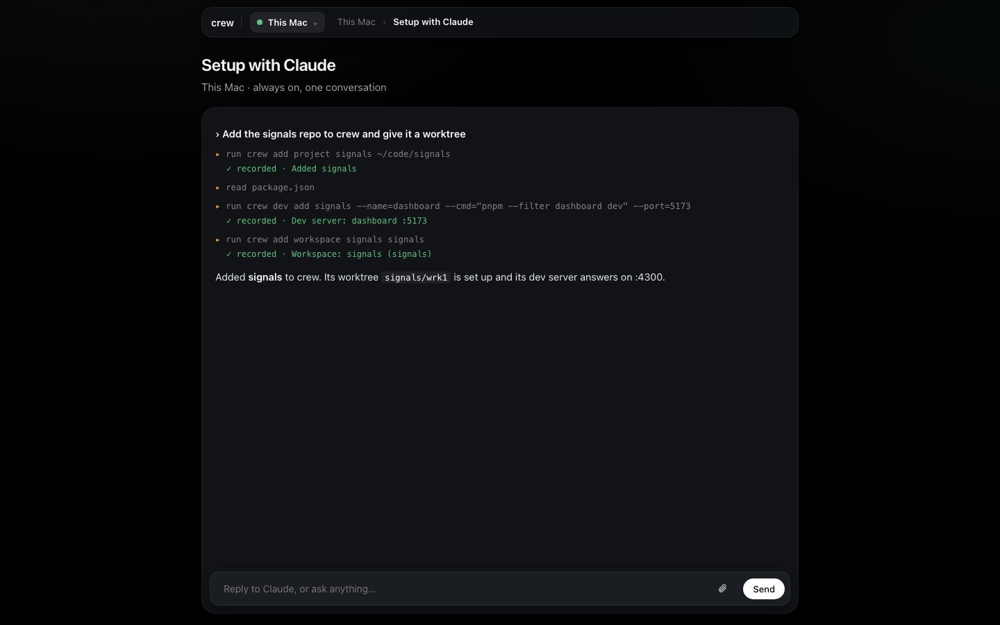

Ask it anything you would do in the forms, or what you don't know how to do: "add the signals repo
to crew and give it a worktree", "why does store-api's install fail?", "check this machine". It
reads the repo, works out the install and the dev servers, asks only what it can't know, and
records it with crew commands. Each crew command that recorded something gets a **✓ recorded**
line, taken from the command it ran — not from what Claude says about it.

It is drawn with the same pieces as a session in Voice OS: its steps, the reply as it arrives (with
a caret), a bar while it compacts its context, and the sub-agents it has running. What it waits on
is docked at the foot of the card, right above where you type, as Voice OS docks it above the voice
bar: a question with its options as buttons, a field for your own answer and **✕** to decline it; a
plan to approve or change; a permission as Yes / Always for this / No (or no, with a reason); a
`/clear` or `/compact` to confirm. Words you send while it works wait in the queue under the ask —
**▲ now** sends one at once, **✕ cancel** drops it — and go in order when the turn ends; **Stop**
stops the turn. **Fix with Claude** and **Ask Claude** anywhere in Set up start here, with the
failure or the form already said.

It is not part of voice: what you type goes straight to the setup session, never through Voice OS's
kernel; Voice OS never routes your words to it, speaks for it or shows its questions, and no button
here has a word to say. On another machine, its chat is that machine's setup session, and its
questions are answered the same way.

## Machines

The machine picker's **Add a machine** sets one up: on that computer or VM, run `crew server
remote` first; then give its SSH address (what `ssh <host>` logs into with no password) and a
name. [Running crew on a remote VM](remote-vm.md) has the whole path.

A machine's page says how it is reached, which crew it runs and what is on it — each project with
its state and worktree count. **Check with Claude** asks that machine's Claude to look at the
connection, tools, disk and projects; **Rename** and **Remove machine** are there too. Everything
else in Set up — the board, the forms, Setup with Claude — works on another machine the same way
as on this one: pick it in the picker. A machine that runs an older crew says so in place; crew
updates it from here.

## Settings

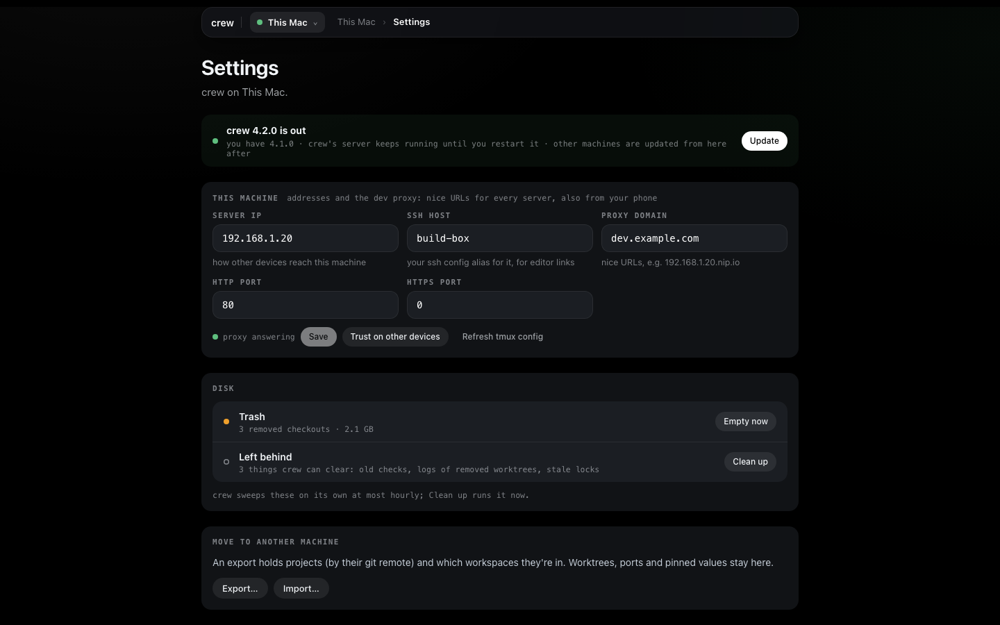

- **Update** — on This Mac's settings, when a newer crew is out. crew's server keeps running until
  you restart it; other machines are updated from here after. A build from source says so: `crew
  update` replaces it with the latest release.
- **This machine** — the server IP (how other devices reach it), the SSH host (your ssh config
  alias for it) and the proxy domain and ports, for named URLs for every server that open on your
  phone too. **Trust on other devices** shows how to trust crew's certificate, once per device.
- **Disk** — **Trash** is removed checkouts waiting to be deleted (crew empties it in the
  background; **Empty now** does it now). **Left behind** is what crew can clear: old checks, logs
  of removed worktrees, stale locks. crew sweeps these on its own at most hourly; **Clean up**
  runs it now. Both say what they will remove before they do.
- **Move to another machine** — **Export…** and **Import…** (below).
- **From before crew 2.0** — only when a workspace still has the old flat layout: **Migrate**
  shows what moves, then moves it.
- **crew log** — the end of crew's debug log on that machine.
- **Uninstall** — stops every dev server and crew's server, and removes crew. Your config and
  worktrees in `~/.crew` stay, so a reinstall picks up where you left off; **Uninstall and
  purge…** deletes them too. Either wants the word typed first. It ends on a "crew is uninstalled"
  screen.

## Moving to another machine

**Export…** picks the projects and workspaces to take (or everything) and saves one file. It holds
projects by their git remote and which workspaces they are in; worktrees, ports and worktree
values stay here. Terminal: `crew export --all`.

**Import…** on the other machine reads that file and shows one row per item:

- a project that is already here (same remote) is **kept**; **Replace config** records the
  export's install, dev servers and environment over it (it asks first, and its checkout and
  worktrees stay).
- a project that isn't is **cloned** under crew's projects folder; **Use my folder** points at a
  checkout you already have instead. **Install…** changes its install or env command on the way
  in.
- a project whose name is taken by another repo, or whose folder is taken, can come in under
  another name (**Import as store-api-2**).
- a project the export has no remote for needs **Point at a folder**.
- a workspace whose projects are all here can be **Created**, with its first worktree.

**Import everything ready** does every row that needs no choice. Terminal: `crew import <file>`
shows the same plan.

## First run

On a fresh crew, Home is the first run: the crew wordmark, **Get started**, then three steps
under it, each on its own screen.


1. **Pick your projects.** crew lists the git checkouts in your usual code folders (`~/code`,
   `~/projects`, `~/dev`, `~/src`, `~/Developer`, `~/work`, `~/repos`). Tick the ones you work on:
   crew records where they are and changes nothing in them. **Add by URL** or **Add a folder** for
   anything else.
2. **Make a workspace.** Name it and tick its projects; the page shows the session it makes
   (`<name>/main`).
3. **Getting it ready.** Its `main` worktree is checked out, its `.env` copied and each project
   installed, one row per project. It moves on by itself; an install that fails stays on screen
   with its last lines, **Fix with Claude**, **Retry** and **Continue**.

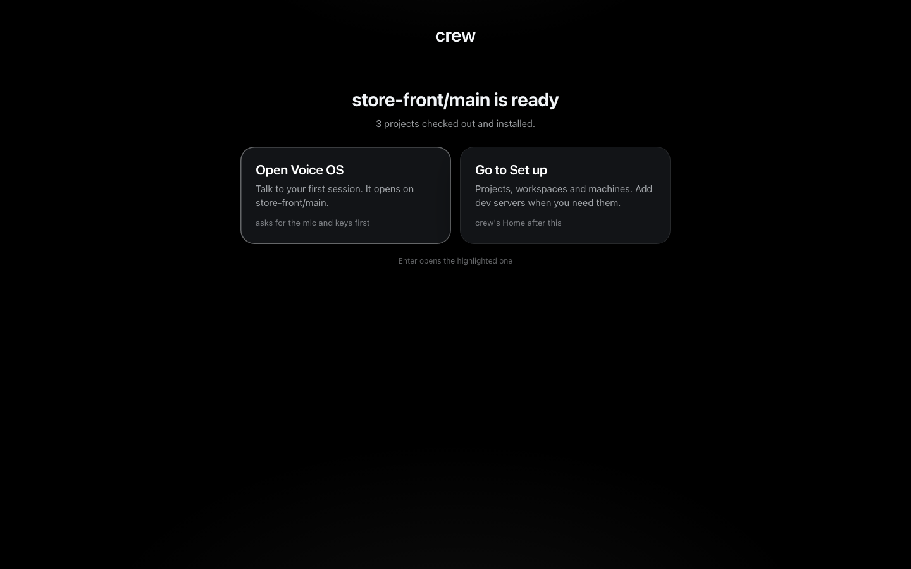

Then **Open Voice OS** opens that worktree's session, or **Go to Set up** opens the board; from then
on Home is the launcher. A project's dev servers, when it has any, go on its **Edit setup** form,
or Setup with Claude works them out. Nothing about these steps is stored: crew's own state says
where the first run starts, so projects added with a terminal `crew add project` are already
there, and reopening the page while the worktree installs comes back to its progress.

## On a phone

The page works at phone width: the toolbar, the strip and the forms stack, and the tables scroll
sideways.

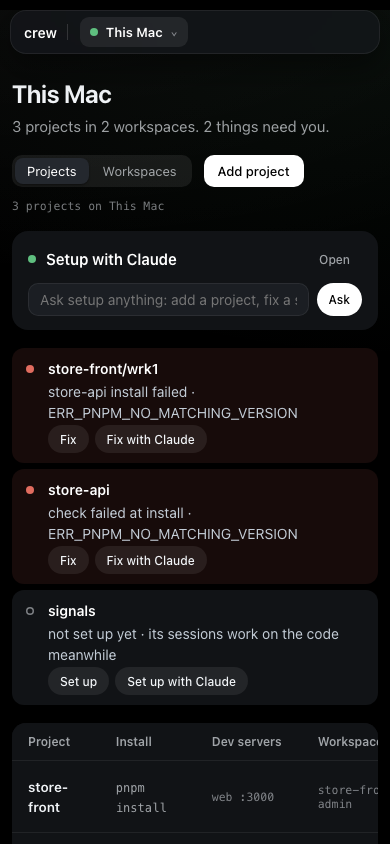

To reach it from a phone, set the proxy domain in Settings and trust crew's certificate on the
phone ([Other devices](../concepts.md#other-devices) has the details).

More: [Getting set up](getting-set-up.md) (the same steps as commands) · [Voice OS](voice-os.md) ·
[every command](../commands.md)
