# Voice OS

Voice OS is the half of crew's web page that runs one Claude Code session per crew worktree and lets
you drive all of them by talking, typing or clicking. The other half, **Set up**, is where projects,
workspaces, worktrees and machines are configured; bare `crew` starts the server and opens the page
on **Home**, where you pick one. You say what you want. A small router (the **kernel**)
decides where your words go, and most of the time that is the session on your screen. Sessions
talk back in short spoken lines, answer questions, ask for permission and report when they are done.
You don't have to watch a terminal.

It runs on your machine, next to crew. The sessions are ordinary Claude Code sessions on your own
Claude Code login, working in crew's worktrees.

Every command, with things you can say for each: [Voice OS commands](voice-os-commands.md).


## Contents

- [Languages](#languages)
- [What you need](#what-you-need)
- [First run](#first-run)
- [Set up and the setup session](#set-up-and-the-setup-session)
- [From two repos to a working feature](#from-two-repos-to-a-working-feature)
- [Home, machines and Settings](#home-machines-and-settings)
- [Listening modes](#listening-modes)
- [Voice off](#voice-off)
- [Talking to sessions](#talking-to-sessions)
- [Active sessions](#active-sessions)
- [Session names](#session-names)
- [Questions, plans and permissions](#questions-plans-and-permissions)
- [Permission modes](#permission-modes)
- [Auto mode and approvals](#auto-mode-and-approvals)
- [Queued messages](#queued-messages)
- [Docs, images and sub-agents](#docs-images-and-sub-agents)
- [Attaching files](#attaching-files)
- [Sessions asking each other](#sessions-asking-each-other)
- [Slash commands](#slash-commands)
- [Dev servers](#dev-servers)
- [Notes and debug notes](#notes-and-debug-notes)
- [Other machines](#other-machines)
- [Running Voice OS](#running-voice-os)
- [Where state lives](#where-state-lives)
- [Troubleshooting](#troubleshooting)
- [Privacy and cost](#privacy-and-cost)

## Languages

You can talk to Voice OS in any language, and mix them, even within a sentence. There is nothing to
pick: Soniox works out which language you're speaking as you speak.

**Works in any language:** where your words go, answers to questions and permissions ("ja",
"ne", "sí"), approvals and refusals, taking words back ("vergiss das"), "that was for checkout",
muting, changing how the tab listens, whether words that name a session are spoken to it, "For
checkout?" answers, and asides versus queued work. A
small, separate Claude Haiku check reads the words whenever Voice OS is about to act on what you
meant (approve something, drop words, mute), and when it cannot tell, Voice OS takes the safe side:
it does not approve and does not drop your words. It runs only on those turns, adding a few hundred
milliseconds and a fraction of a cent there, and nothing to a plain message to a session.

**English only, for now:**

- **Stop words.** "Stop", "wait" and "no" cut Voice OS's speech at once in English. In another
  language they stop it a moment later, once the kernel has heard them.
- **"End of turn".** In another language a turn ends on the pause instead.
- **The wake word** is "Voice OS", however you say the rest.
- **Typed keywords** ("by the way", "queue it" at the start of typed text).
- **Voice OS's own lines** ("Sent to checkout", "Switching to…") are spoken in English. The
  sessions answer in whatever language you use with them.

## What you need

- **crew**, installed. Voice OS shows crew's worktrees and adds nothing of its own. With no
  worktree yet, [Set up](#set-up-and-the-setup-session) makes one for you (or type it out with
  [Getting set up](getting-set-up.md)).
- **tmux**, because Voice OS runs in a tmux session that crew keeps alive.
- **Claude Code** (`claude` on your PATH), signed in. Every session is Claude Code on your login,
  on whatever plan you already have.
- **An Anthropic API key**, used by the kernel (which routes what you say) and the narrator
  (which writes the spoken summaries). This key is separate from your Claude Code login.
- **A Soniox API key**, used for speech-to-text and text-to-speech.
- A **browser** with a microphone. Voice OS works on macOS and Linux (x64 and arm64). The Linux
  builds need glibc, so musl distributions such as Alpine are not supported.

`crew doctor` shows what is missing, and `crew doctor --install` installs it.

## First run

```bash
crew
```

Bare `crew` starts crew's server if it is not running and opens the page in your browser (`open`
on macOS, `xdg-open` on Linux). With no terminal, over SSH or with `--no-open` it prints the link
instead. The first run:

1. Checks for tmux, and names it with its install command if it is missing. A missing `claude` is
   shown on the page.
2. Downloads crew's server for your platform (25–40 MB) from the crew release matching your crew
   version, into `~/.crew/bin/voiceos`.
3. Starts it, prints its sign-in links and opens the localhost one. It never asks for keys: the page
   does, the first time you open Voice OS (see below). `crew server start` is the terminal form,
   and it asks for missing keys at a terminal, hidden as you paste.

The output looks like this:

```
up	41873	http://localhost:41873/login?token=…	https://voice--os.192.168.1.20.nip.io/login?token=…
```

The columns are the state, the port, the localhost link and the link through crew's dev proxy. A
line under it says which one to open.

Open the **localhost** link on the machine running Voice OS. The link signs that browser in by
setting a cookie. If you lose the cookie, or want to sign in from another browser, run
`crew` again: it reprints the links without restarting anything.

> **Microphone access.** Browsers allow the microphone only on `localhost` or over HTTPS. The
> localhost link always works on the machine itself. To use a phone or another computer, open the
> proxy link: it works once crew's dev proxy serves HTTPS and that device trusts crew's certificate
> authority (`crew dev proxy trust` shows how, once per device). Until then the proxy link works
> for text and clicks only.

On a phone the page fits the width: the top bar keeps the tabs (they scroll sideways), and the
session's stream takes the screen, with the spoken line and the input under it.

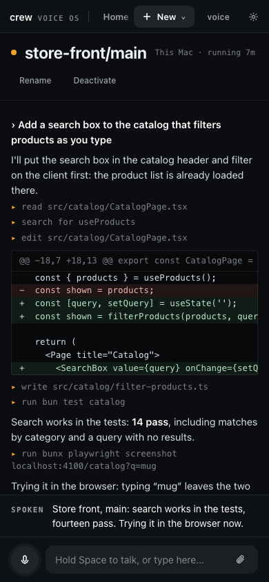

**Keys.** The first time you open Voice OS without them, the page asks for the Anthropic and
Soniox keys (and the microphone). Each key is checked with its service before it is saved; a
rejected one is shown in red with what to do. Without them Voice OS still works for typing and
clicking. A key saved while it runs — on the page, under Settings, or with
`pbpaste | crew server keys set soniox` in a terminal — is used from your next words on, with no
restart.

**Where to get the keys:** an Anthropic API key from the [Anthropic Console](https://console.anthropic.com),
and a Soniox key from your Soniox account at [soniox.com](https://soniox.com). Both are billed per
use (see [Privacy and cost](#privacy-and-cost)).

**On a fresh crew**, Home greys out Voice OS until a project exists: open **Set up**, pick your
checkouts and make a workspace, and [the walkthrough](#from-two-repos-to-a-working-feature) goes
from there to a working feature.

## Set up and the setup session

**Set up** is where crew is configured, one machine at a time: projects (install, dev servers,
environment), workspaces, worktrees, machines and settings, each a form that runs a `crew` command
and shows it. Beside the forms, each machine has its own **setup session**: a Claude Code session in
your home folder, with the crew CLI, that you type to in Set up's **Setup with Claude** chat. It
reads a repo, works out its install and dev servers, asks only what it can't know and records it
with crew commands; the chat shows each command it recorded.

The setup session is not part of voice. Voice OS never routes words to it, never says what it does,
never puts it in the meanwhile line or offers to switch to it, and its questions and permissions
are answered in the chat, not aloud. It still runs on every machine, started with Voice OS and kept
running, so the chat answers whenever you open it. Asked by voice to add a project or make a
worktree, Voice OS says it is done in Set up; on a session's screen such words go to that session,
like any other work. [The Set up guide](setup.md) walks every page and the chat.

It runs in auto mode like every session, and it asks before anything destructive. crew moves a
removed checkout to its trash and empties it in the background, and deletes the worktree's `crew/…`
branches, so treat a removal as final.

A new worktree shows up in Voice OS's **Activate** list by itself within a few seconds, because
Voice OS rereads crew's worktrees every 10 seconds. It starts inactive: activate it to talk to it.

## From two repos to a working feature

This is the whole loop by voice, on two small repos: `store-api` serves products and `store-app`
lists them from `API_URL`. Each dev command must listen on the port crew hands it in `$PORT`
([Getting set up](getting-set-up.md#2-add-your-projects) says how).

1. **Set it up.** In Set up, tick both checkouts and make a `store-front` workspace with them, then
   ask Setup with Claude: "Work out the dev servers for store api and store app, and wire the store
   app's API URL to the store API." The setup session reads each repo, records its dev server with
   `crew dev add` and the binding with `crew add binding`, and runs `crew check project` until each
   passes.
2. **It reports back** in the chat, with a line for each crew command it recorded.
3. **The worktree appears.** `store-front/main` shows up on Voice OS's Activate list.
4. **Activate it and start its servers.** "Activate store front main." "Activated
   store-front/main. Switch there?" "Yes." "Start the dev servers." Both come up on this
   worktree's own ports.
5. **Build something.** "Add a search box to the store app's product page that filters the
   products by name as you type. When it works, take a screenshot of the page and show it to me."
   The session writes the code, restarts the servers through crew and checks its work.
6. **See the result.** If its Claude Code has a browser tool (for example the Playwright MCP
   server), it tries the page in a browser and its screenshot shows in the session's stream, on
   whichever device you are using. Without one, it checks what it can from the shell and tells you
   what to look at.

## Home, machines and Settings

Voice OS opens on **Home**. On the left are your active sessions, one row each, from every machine,
each with its state. Whatever waits on you comes first, tinted, with **Answer**. Up top sit the two
ways to start something: **New session** and **Activate a worktree**. On the right is a card for
each machine with what it holds (worktrees, how many are active, plain sessions), and under them a
few things you can simply say instead.

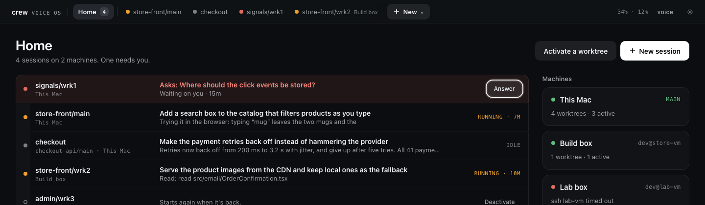

The bar along the top has the crew mark (back to crew's Home), **Home** with its count, a tab for
each active session with its state dot (and its machine when it is not This Mac), and **New**. New
opens a menu: New session, Activate a worktree, and each machine, which opens that machine's page.
Your Claude usage (weekly and 5-hour), **voice** and the settings gear are on the right; the gear
becomes a **Settings** tab while Settings is open.

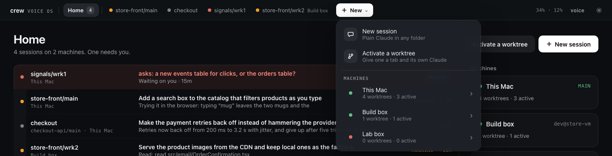

Drag a session's tab to put it somewhere else, or focus it and press **Alt+←** / **Alt+→**. A white
line shows where it will land. Home's list follows the same order, and it is kept across restarts.

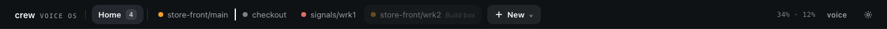

**A machine's page** is where you go into a remote. A switcher on top moves between All machines and
each machine. A machine's header says whether it is connected, its host, **Open in Set up** for a
remote, and **New session on …**. Below a search field come its plain sessions, then its worktrees
grouped by workspace. A worktree with words waiting for it shows them ("1 waiting: …"); a machine
out of reach has its rows dimmed and says why. **Activate** on a row starts that worktree's Claude:
it gets a tab and a row on Home, and the page stays where it is. Worktrees are made in Set up, not
here.


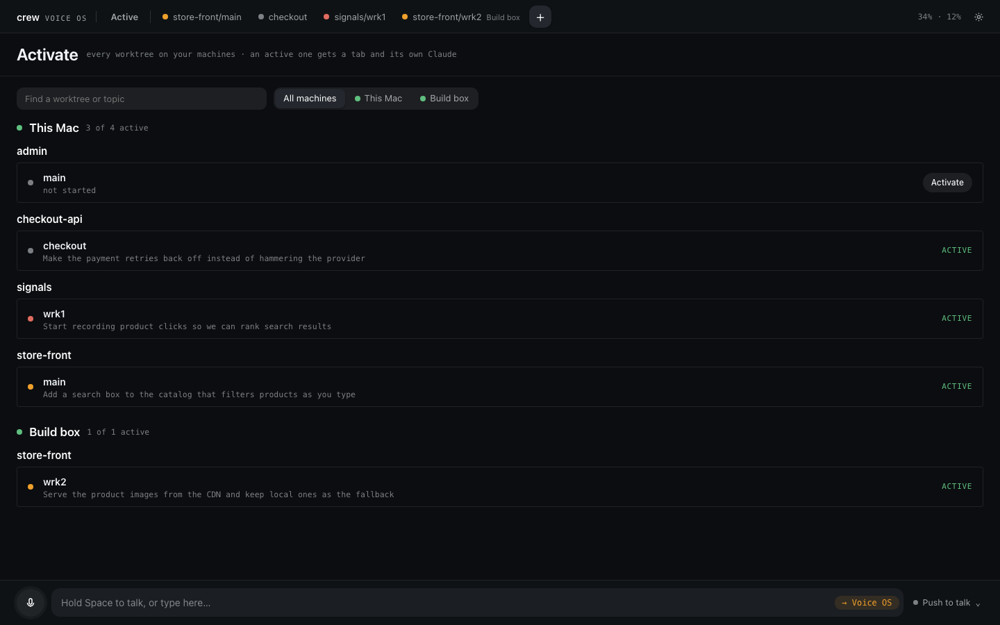

**Plain sessions.** Not everything is a worktree. **New session** (on Home, in the New menu, or on a
machine's page) opens a dialog: pick the machine, a folder there (your recent ones are a click
away; home when you name none) and a name. Saying "start a new session called research in my notes
folder" does the same. It is a plain Claude conversation with no crew instructions and no dev
servers, and it is active at once. Talk to it by its name like any session; **Remove** on its page,
or "remove research", stops it and drops it from the list, leaving the folder alone. crew keeps
them per machine (`crew chat add`, `crew ls chats`, `crew chat rm`).

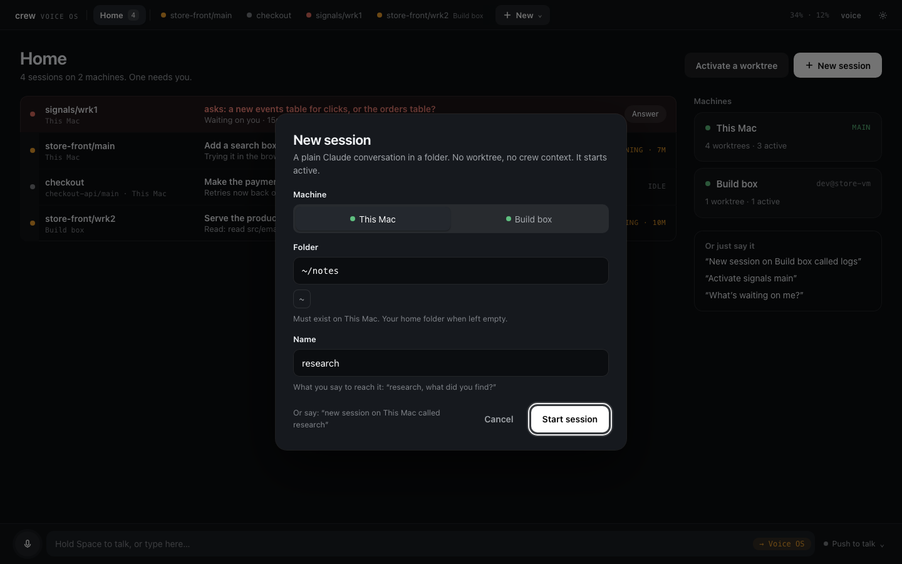

**Settings** is one page with a menu down the side: how you listen (four modes, each explained),
voice off, the two keys (checked before saving), Discord, session names, your machines, and whether
crew opens straight into Voice OS.

**Sending things to Discord.** With Discord set up, ask a session to send something there ("send
that screenshot to Discord", "post the summary in Discord") and it runs `crew server discord send`,
from this machine or any remote: the main posts it with the bot. Messages go to the voice channel's
own chat, or to a text channel you pick under **Settings → Discord → Messages** (or `crew server
discord setup --text-channel=<name>`). Sessions are told about it only when Discord is set up, and
they post only when you ask.

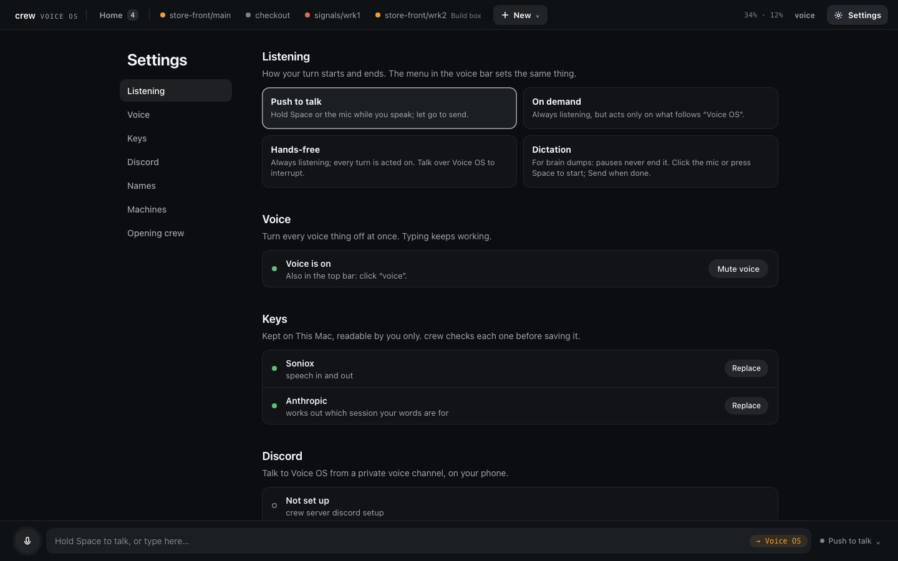

Click a row or a tab to open that session. Opening a session only shows it. An inactive session's
page shows its history and an **Activate** button, with no input box (see
[Active sessions](#active-sessions)).

**Esc** goes up one level: from a session to Home (or to the machine's page, for one you opened from
there), and from a machine's page or Settings to Home.

The session page shows the conversation as it streams, what the session waits on (a question with
its options, a plan, a permission) docked right above the voice bar, what went wrong under its
header (a blocked call, a remote that dropped, a crash with Restart), and side panels: status
and cost, sub-agents, dev servers, what you said here, notes, docs, and **elsewhere** (sessions on
other screens that need you). Only the stream scrolls.

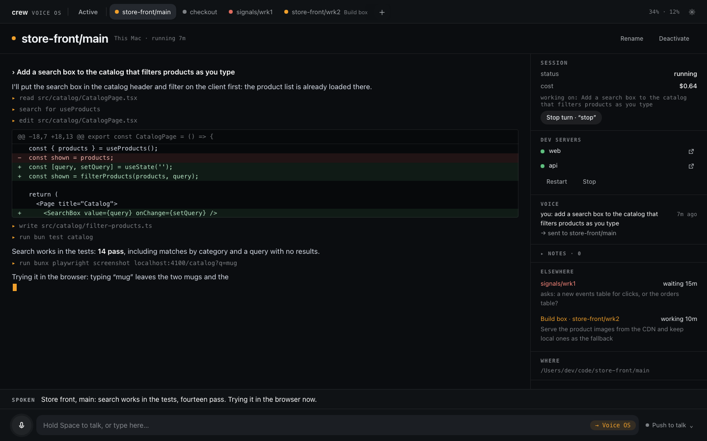

By voice:

- "Home." · "Go to active." · "Show me everything." · "Go back."
- "Open store front main." · "Show me the checkout one." · "Switch back to store front main."
- "Show me the locale work." Sessions can be named by their worktree or by what they are working
  on.

## Listening modes

The round button next to the mic opens the menu that chooses how the tab listens. Each tab remembers its own mode, so a
second tab never starts listening on its own.

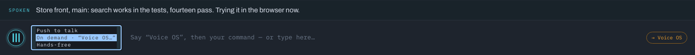

| Mode | How it works |
| --- | --- |
| **Push to talk** | Hold **Space** (anywhere except in a text field), or hold the mic button. Release to send. |
| **On demand** | Always listening, but Voice OS only acts on what follows "Voice OS": "Voice OS, tell checkout to run the tests." A chime says it heard its name and the input shows *Listening to you*. The turn ends when you pause, or at once when you say "end of turn". A second request needs "Voice OS" again. |
| **Hands-free** | Always listening. Every sentence is a turn. |
| **Dictation** | For brain dumps. Click the mic (or press **Space**) to start and talk as long as you like: pauses never end it, and "stop" or "wait" are just words. **Send** sends everything, word for word, to the session on screen, marked as dictated. It never goes through Voice OS's routing. **Discard** throws it away (it asks once more when there are words). With no session on screen, or one waiting on your answer, the words land in the text box to send from there. |

You can also switch modes by voice: "Switch to on demand." · "Hands-free on." · "Turn off
hands-free." · "Push to talk." Voice OS confirms the change aloud.

Tips:

- **Talking over it.** Pressing the talk key cuts off whatever Voice OS is saying, and in
  hands-free you can simply talk over it. "Stop", "wait" and "no" count as yours even right after
  Voice OS spoke.
- **Noisy rooms.** On demand is the mode for a room with a TV or other people: nothing is acted on
  until someone says "Voice OS". Say the name and the request in one breath. If you pause after
  "Voice OS", whatever is said next becomes the request.
- **"End of turn."** In either always-listening mode this sends what you said right away instead of
  waiting for the pause.
- Background talk, music and a half-finished "and can you—" are ignored, and Voice OS says nothing
  about them.
- **Cost.** Both always-listening modes stream your microphone to Soniox for as long as listening
  is on, so they cost the same. Push to talk streams only while you hold the key, and dictation
  only until you send it.
- **Phones.** A phone may stop the microphone when the tab goes to the background or the screen
  locks. Bring the tab back to the front to continue.

You can always type instead. The chip at the end of the bottom bar shows where your words will
go. For speech it reads **→ Voice OS** (the kernel decides), or **answering …** when something is
waiting on you. Once you start typing on a session page it reads **→ store-front/main**, because
typed text goes to that session.

> **Typed text on a session page goes straight to that session**, just as if you had typed it into
> Claude Code. The kernel is skipped, so a typed "deactivate this" reaches Claude, not Voice OS.
> There are two exceptions: text that starts with another session's name ("checkout, run the
> tests") goes through the kernel, and so does anything typed while the session is waiting on your
> answer. Voice OS commands work when spoken, or when typed on Home, a machine's page or Settings.

## Voice off

**voice** in the top bar, next to the settings gear, turns all voice off in one click, for a
meeting, a call or a quiet office:

- Nothing listens. No tab and no Discord channel streams to Soniox.
- Nothing speaks.
- The Discord bot leaves its voice channel.

Typing and the page work as usual. What Voice OS would have said still shows on the page, and you
answer a question by typing.

While voice is off, **voice** is struck through, both in the top bar and where the mic was. Click
either one to turn voice back on. Each tab listens again in its own mode, the bot rejoins the
channel, and nothing from the quiet time is read out. Voice OS plays its title again each time you
turn voice off or on, with "Voice" struck through while it is off. The setting is for the whole
server and lasts across restarts.

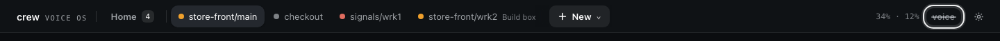

## Talking to sessions

Speak the way you would to a colleague. Filler, restarts and half-sentences are fine, and there
is no need to phrase anything carefully.

**The session in front of you** gets anything about the work: instructions, questions, reactions
and half-formed thoughts.

- "Hmm, I don't like that. Revert the last change."
- "Why is this so slow?"
- "Okay, the retry works but it's too aggressive. Cap it at three attempts and log each one."
- "Could we brainstorm a bit first?"
- "What's the last thing we've done?" The session remembers its own conversation.

The session gets your words exactly as heard, never a rewrite, so nothing you said is lost. When
one sentence did two things ("restart the servers and have it check the logs"), the session gets
its part, copied word for word. Voice OS does not answer these questions itself and does not ask
what you meant. If the session needs more, it asks you.

**Other sessions**, without leaving the one you are in:

- "Tell checkout to add backoff to the webhook retries."
- "Checkout, run the tests."
- "Is anything waiting on me?" · "How's checkout doing?" · "What's the ranking work doing?"
- "What did the session say?" Voice OS reads the session's last reply back, including any choice it
  left you.

**Words go to the session on screen, or to one you name.** Say "checkout, is the build green?" and
you stay where you are: the words go to checkout, and Voice OS says so and offers to follow them in
one line: "Sent to checkout. Switch there?" (yes switches; anything else keeps you where you are).
A short answer from checkout is said at once, with its name; a longer one comes back in the
meanwhile line, like any other session's update. A session is named by its name ("checkout",
"store front work one") or the name you gave it, not by its work.
Words that only mention one ("put it on top of the checkout branch") get "For checkout?": yes sends
them there; no, or silence, keeps them on the session on screen ("Kept on crew"). The eight seconds
for an answer start when you have heard the question. Anything that names no session is for the
session on screen, whatever you heard last: Voice OS never guesses that words were meant elsewhere.
A follow-up ("and the lint?") is no exception: name checkout again, or switch there.

- "Where am I?" · "Who am I talking to?" "You're on crew."
- "Switch to it." Right after a session's line, opens that session.
- "Go back." Returns to the session you were on before, saying "Back to crew"; say it again to go
  further back. A session that stopped is passed over ("checkout stopped. Back to crew."). "Go back
  to checkout" goes to checkout, wherever you came from. "Home" opens Home.
- "No, that was for store front." Resends your words there. If the session that got them is still
  working on them, it is stopped: "Stopped checkout."

When Voice OS switches for you, it says so first: "Switching to checkout" (a click is silent).

**Activating, deactivating and interrupting** (see [Active sessions](#active-sessions)):

- "Activate checkout." · "Start checkout." "Activated checkout. Switch there?"
- "Start checkout and tell me what it did last." Activates it and sends it the rest once it is up.
- "Deactivate checkout." · "End the checkout session." Stops it; the conversation resumes the next
  time it is activated.
- "Stop." · "Wait." · "Hold on." Interrupts the session on screen while it is working. The session
  stays open.
- "Actually, stop the refactor and fix the login bug first." Voice OS asks whether to stop the
  current work and switch (**Switch** / **After**).

**How Voice OS keeps the conversation going.** It aims to be responsive, not talkative, and every
one of these stays quiet when in doubt:

- **A quick acknowledgement.** When what you said goes to Voice OS to decide, and nothing answers
  within about a second, you hear a short "Mm-hm.", "Got it." or "One sec." so you know you were
  heard. It is skipped for a few words ("yes", a name), while you are talking, when Voice OS spoke a
  moment ago, when it is muted, and whenever the answer is already on its way. After a question it
  is only "One sec." or "Let me check.", so it never sounds like a yes or like done. It never asks
  or promises anything, and it is the same with push to talk, hands-free and Discord.
- **Its own lines in its own words.** "Sent to checkout. Switch there?", "Switching to checkout",
  "Back to crew", "Activated checkout…" and "Okay, after its current work." (when it asks no "Send
  it now?") are worded fresh each
  time ("Passed that to checkout. Want to go there?"), by a small model, in under a second. They
  always name the session as you know it and ask "switch?" only when the switch is really offered;
  when the wording is late or breaks a rule, you hear the plain line instead. Without the Anthropic
  key you always hear the plain lines.

**What you hear from sessions you are not looking at.** Sessions on other screens don't talk over
you. Nothing is dropped while you talk: what was queued waits, and the answer to what you just said
plays first. Other sessions' updates wait for a quiet moment (8 seconds with push to talk, 12 when
listening, never more than 50 seconds) and come as one line: "Meanwhile, ranking needs you about the
index, checkout said: all retry tests pass, and two others finished." Each session is described in
its own words (its last line, shortened), never by an old summary. An update you already met (you
switched there, answered it, or spoke to that session) is not said again. The top bar shows **N updates
waiting** until then; click it, or say "What did I miss?", to hear them now. The full message of a
session plays when you switch there. Another session's permission or question waits for the line
playing to end, plus a breath. A session still waiting on you is mentioned again ("checkout still
needs you") every five minutes, at most three times, while a Voice OS page is open.

**Replying to an update.** When the meanwhile line is about one session, it ends with "Switch
there?": yes switches there and plays its update; a no closes the question, and anything else
keeps you where you are. When it names several sessions it asks nothing: say which one ("switch to
checkout"). Words after an update still go to the session on screen unless you name the other
session ("checkout, push it"); "switch to it" right after an update opens that session. A question
the meanwhile line says in full ("checkout asks: Postgres or SQLite?") is answered where you are.

- "Quiet." Drops what Voice OS had queued to say and stops its routine narration. The sessions' own
  lines, questions and alerts still play.

## Active sessions

Only **active** sessions exist for voice. You activate the few you are working with; everything
else stays quiet until you activate it.

- **Active:** Voice OS runs the session's Claude, and voice controls it fully: talking to it,
  switching to it, its dev servers, its updates, its questions and permissions.
- **Inactive:** no Claude process and no sound from it. Voice doesn't see it: it sends no updates,
  dev alerts or reminders, and the kernel does not read it. You can still browse it on the page and
  activate it there. Its dev servers keep running; crew owns them, and Voice OS says nothing about
  them.

**Home** shows the active sessions from every machine. An active session's tab is in the top bar,
and Esc goes back to Home.


- **Activate** starts the session and resumes its conversation. By voice ("Activate the scheduler
  on Build box.") you hear "Activated scheduler. Switch there?"; from the **Activate** button on a
  row on Activate or on an inactive session's page, nothing is said. If two sessions match,
  Voice OS asks which ("Build box has scheduler work one and work two. Which?").
- **Deactivate** stops the session and drops everything Voice OS still held for it (queued words,
  questions, updates). Its conversation is kept for the next time. A session that is working asks
  first: "checkout is working. Deactivate anyway?" Deactivating the session on screen keeps you on
  it.
- **Words to an inactive session**, whether you name it or say them on its screen, get "checkout
  isn't active. Activate it?". A yes activates it and delivers your words once it is up. Dictation
  and typing on an inactive page are kept the same way.
- **Asking what there is:** "What machines do I have?" · "What's on Build box?" · "What's active?"
  · "What's in the store front workspace?" You hear counts first ("Build box has 11 worktrees in 6
  workspaces; none active"), and names when the list is short.
- These are Voice OS commands even on a session's screen: they are answered, never forwarded.
  "What's running in the tests?" is about the work, so it still goes to the session. Starting with
  "Voice OS, …" always reaches Voice OS.
- On a machine that is out of reach, activating adds the session to the set and you hear "Build box
  is out of reach; it starts when it's back". Its row stays on Home ("… · Build box out of
  reach"); if the worktree was removed, the row reads "gone". Deactivate it to let it go.
- A setup session is never active: it runs for Set up's chat (see
  [Set up and the setup session](#set-up-and-the-setup-session)). An `active.json` from an earlier
  release that listed one is read without it.
- The active set is kept in `~/.crew/voiceos/active.json` and survives restarts (see
  [Running Voice OS](#running-voice-os)). The first start after the update turns your old pins
  (`pinned.json`) into the active set.

## Session names

By default a session is called by its worktree (`store-front/main`). You can give it a name you
would rather say, such as "api work". Voice OS shows that name everywhere and answers to it.

- Click **rename** on a session's header, or under Names in Settings, type the name and press Enter. An empty
  name clears it and brings back crew's label. Esc keeps the old name.
- By voice: "Rename this to api work." · "Call checkout main payments." · "Call store front main on
  Build box api work."
- A name belongs to one session: a name that is already taken is refused. Names can be up to 60
  characters.
- A named session is never spoken with its machine in front: you chose the name to stand on its
  own.
- Names are kept in `~/.crew/voiceos/names.json`. They are Voice OS's own and change nothing in
  crew or git.

"Rename the function to parseRef" is work, so it goes to the session. "Rename store-vm to Build
box" renames a machine (see [Other machines](#other-machines)).

> The active set and names are Voice OS preferences, not crew state, so they have no `crew`
> command. Use the page or your voice.

## Questions, plans and permissions

When a session asks you a question, shows a plan or asks for permission, you hear it and the page
shows it in the dock at the bottom. Answer it the way you would answer a person, or click.

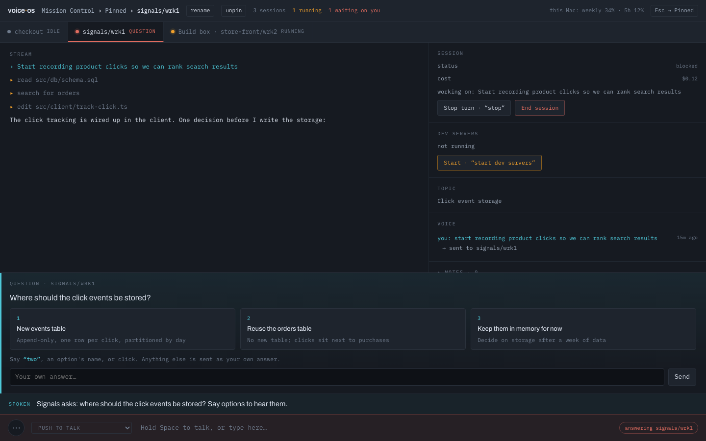

A permission looks the same, with the command it wants to run and **Yes** and **No** under it. Type in
the box below them to say no and tell it why.

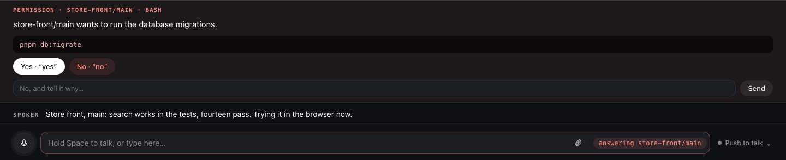

- "Yes." · "Go ahead." · "Always." ("Always" is offered when Claude Code suggests a rule. Voice
  OS hands that suggestion back to Claude Code unchanged, so the rule is kept wherever the
  suggestion names: for this session only, or in one of your Claude Code settings files, where it
  lasts beyond this session.)
- "No, use a new branch." Declines, and your reason reaches the session.
- "Yes, but push to a new branch afterwards." Approves, with a note.
- "The second one." · "Reuse orders." Picks an option by position or by name.
- "Options." Reads the choices out again.
- "Why does step three touch the kernel?" Asks about the plan without answering it. The session
  answers on the side and the plan keeps waiting.

A plan has **Approve**, and **Change the plan…** to send it back with your notes. A permission
has **Yes**, **Always for this** (when offered), **No**, and **No, and tell it why…**. A question
has an **✕** to decline it without answering: the session is told you declined, and carries on
without your answer.

If you say something unrelated ("actually, let's look at the router first"), you are moving on:
your words go to the session, and they decline what it was waiting on.

A bare "yes" answers whatever was just asked aloud, even if it came from a session you are not
looking at. If two things are waiting and it is unclear which you mean, Voice OS asks
("Yes to which — ranking or checkout?").

`/clear` and `/compact`, typed or said ("slash compact"), wait for a yes before they reach the
session.

Another session's request for work, or for a secret, docks and is answered the same way. See
[Sessions asking each other](#sessions-asking-each-other).

## Permission modes

Each session has a permission mode, shown on the chip left of its text box. Tap the chip and pick
one, type `/mode plan` (or auto, ask, skip), or say "switch to plan mode" or "put checkout in ask
mode". The session switches at once and keeps the mode until you change it, across restarts too, and
its stream shows the change ("Mode: Plan").

- **Auto**, the default: Claude Code's classifier lets routine work run and blocks what looks risky
  (see below).
- **Plan**: the session plans and changes nothing. Approving its plan puts it back in the mode it had
  before Plan.
- **Ask**: every permission comes to you as a card, the way Claude Code asks in a terminal.
- **Skip**: Claude Code's skip-permissions mode. Everything runs, nothing is checked. Said aloud,
  Voice OS asks first ("Skip permissions for checkout?"), and a session in Skip shows **skip** on its
  tab and in Active. Claude Code refuses Skip when it runs as root, so on such a machine the session
  stays in the mode it had, with a line saying why.

Questions and plans always come to you, in every mode. Set up's chat stays in Auto.

## Auto mode and approvals

Sessions start in Claude Code's **auto** permission mode. Routine work runs without asking, and
Claude Code blocks a call it judges risky instead of running it. You do not approve every file
edit and command. Plans and questions are different: they always wait for you, in any mode.

Whether auto mode is available depends on your Claude Code account, model and settings. Voice OS
asks for it but does not check what Claude Code did with the request; any permission prompt
Claude Code raises comes to you like the others.

When auto mode blocks something, the session page docks a red **blocked** prompt above the text box
that says what the session was trying to do ("Auto mode blocked store-front/main from trying to run git push"), and
Voice OS tells you.

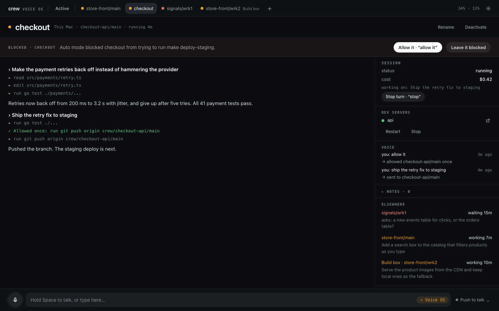

- **Allow it** (or say "allow it" / "let it") lets that one call through. The session retries it,
  and the stream shows **✓ Allowed once: …**. Only that call is allowed: auto mode is back for the
  next one, and any allowance still unused ends with the turn.
- **Leave it blocked** dismisses the strip. The session carries on without it.

Asking "why is auto mode off?" or "why do you keep asking me?" on a session's page goes to the
session. Voice OS does not guess at causes.

> **Trust.** Auto mode is Claude Code's own safety check, and your Claude Code settings (allow and
> deny rules, CLAUDE.md files, plugins) still apply, because sessions load your user, project and
> local settings. Voice OS never widens what a session may do on its own: "Allow it" lets one
> call through, and "Always" saves only the rule Claude Code itself suggested. A session's
> environment has `ANTHROPIC_API_KEY` and the Soniox key removed.

## Queued messages

A session works on one thing at a time. What you send while it is busy waits in its queue, shown
under the stream as **queued 1**, **queued 2**, and so on. Each message goes in order when the
current work ends.

- **Said aloud to the session on screen,** Voice OS asks: "Okay, after its current work. Send it
  now?" A yes (or **Send now** on the card) sends it at once, as **▲ now** does; a no, or carrying
  on, keeps it queued. If the session finished first, you hear "It already went." Not asked for
  questions (they go on the side), for words to another session (that line asks "Switch there?"),
  or while another question of Voice OS's is open.
- **▲ now** sends that message at once. It interrupts the current work and goes first.
- **✕ cancel** removes it from the queue.
- By voice: "Why are you queuing it? I want it now." · "Do that first." With more than one of your
  messages waiting, "send them all now" sends them together as one.
- "Take that back." · "Don't send that." Removes your last message if it is still waiting. If it
  already reached the session, the session is told to ignore it.
- "Sorry, I meant that for store front main." Sends it there instead and takes it back from the
  wrong session.

**Questions don't queue.** A question to a busy session is answered **on the side**: a short fork
of its conversation answers it without stopping the work, and with every tool denied. Asides are
not saved and are gone after a restart. You can steer this:

- Start with **"by the way"** to force an aside ("by the way, which file holds the retry config?").
- Say **"queue it"** to force the queue.
- A question that needs tools or changes the work is queued after all.

Instructions always queue, unless you say they go now ("tell it right now to stop pushing").

## Docs, images and sub-agents

- A screenshot, chart or diagram that a session makes shows inline in its stream. Voice OS stores
  the image and serves it itself, so it shows on your phone too. Images are kept for 30 days.
- Docs and artifacts a session links (claude.ai artifacts, Google Docs, Sheets and Slides, Drive
  files, Notion pages) become cards, and the session's **docs** panel keeps them together.
- "Open the doc" opens the session's newest doc, and "open the risks doc" opens the one you name,
  in the browser tab you spoke from. If the browser blocks the new tab (phones usually do), a
  banner offers the link to tap.
- "Add a section on the rollout risks to the doc" is work, so it goes to the session, which edits
  the doc itself.
- While a session runs sub-agents, the **sub-agents** panel lists each one with its current step.
- Click a sub-agent's card, or the "start a subagent" line in the session's stream, to open its
  transcript: its calls, results and text as they happen, and its last words as its report once it
  ends. The last ten sub-agents of each session are kept until Voice OS restarts or the conversation
  is cleared.

## Attaching files

You can hand a session a screenshot, a log or any other file. On a session's page, paste it
(Cmd+V), drop it anywhere on the page, or click the paperclip beside the box. The same works in Set
up's Setup with Claude chat. Each file becomes a chip above the box, a thumbnail for an image and
the name and size for anything else, and every tab you have open shows the same chips. The ✕ on a
chip takes it off. With no session on screen there is nothing to attach to, so Voice OS says "Open
a session to attach files." and keeps nothing.

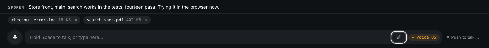

The files go with the next words that reach that session, whether you type them in its box, say
them on its screen, or say them to it by name from somewhere else ("Sent to checkout with 2 files.").
Pressing Enter with only files in the box sends them on their own. A file still uploading when you
press Enter holds the message until it is in; words you speak meanwhile go without it, and it waits
for the next ones. A question you would normally ask aside goes queued when it carries files,
because the side answer has no tools to open them.

Claude gets each file as a path on the machine the session runs on and opens it itself, so any file
type and size up to 20 MB works, and a session on another machine gets its own copy before your
words arrive. Up to 10 files wait on a session at a time. Chips you never sent are gone after a
restart, and the files themselves are kept for 30 days.

## Sessions asking each other

Your sessions can reach each other, on the same machine or across machines. Each one has three tools
for it, and they use them when the work needs another session's knowledge or files. You can also
just tell a session to: "ask checkout which retry limit it used", "pass the new schema to checkout".
Names work the way they do when you talk: "checkout" means the session on the asking session's own
machine first, and a name that still matches two sessions comes back as a question to you ("Checkout
on This Mac or on Build box?").

**Asking.** `ask_session` gets an answer without interrupting the other session. Voice OS makes a
copy of that session's conversation, and the copy answers from what the session knows. When it has
to look something up it can read and search files in that session's own folders, nothing else: it
cannot run commands, change files or reach another worktree. The asking session waits for the
answer, up to three minutes, and can get files back with it. The other session never notices.

**When an answer needs real work.** If the copy would have to run something (the tests, a server, a
query), it says so instead of answering, and Voice OS asks you: "Store front wants checkout to run
the staging check. Allow?" The request docks above the box on the asking session's screen, like a
permission, and a bare "yes" or "no" answers it from anywhere. Allow, and the work goes to checkout as
store front's request; when that turn ends, checkout's reply goes back to store front as a message.
No, or 15 minutes without an answer, and nothing happens.

**Telling.** `tell_session` hands the other session a message and files after its current work, the
way your own queued words wait. It arrives marked as coming from that session, and it is information,
not a task: the session uses it if it fits what you asked it to do and never starts other work
because of it. Its card says who sent it, and it is never merged with your own queued words.

**Secrets.** Files that look like secrets (`.env`, keys, certificates, credentials) never go through
asks or tells, and the copy never reads them. A session that needs one asks with `request_secret`,
naming an env variable (`STRIPE_KEY`) or a file in the other session's folders, and you are always
asked first: "Store front wants a copy of checkout's STRIPE_KEY. Allow?" Allow, and Voice OS copies
it straight from one machine to the other into a temp file only you can read. The asking session
gets the path and copies or sources it from there; neither Claude, the page, the voice log nor the
log ever holds the value. The copy is deleted when that session stops, and after a day at the latest.

On the page, the asking session shows a card where it asked, with the answer and any files, and the
asked session shows the same exchange dimmed, since its own conversation never saw it. Voice stays
quiet unless something needs your Allow. A session can make three requests to other sessions per
turn, and a session told something by another cannot tell it back in the same turn, so two sessions
never keep each other going while you are away.

## Slash commands

Type `/` at the start of a session's box, or in Set up's chat, and a menu opens with that session's
commands: Claude Code's own that work here, your project and user commands, skills and plugin
commands, each with its description, then Voice OS's own. Typing narrows it, the arrow keys move,
Enter or Tab picks, Esc closes. Picking one of Claude's fills it in so you can add what it should work
on (`/review the auth change`), and it goes to the session as words, as in Claude Code. The list
follows the session: a skill it discovers or a plugin you add shows up without a restart.

Voice OS's own commands run on the page instead of going to Claude. `/reload-plugins` and
`/reload-skills` reload that session's plugins or skills and say what changed in its stream; when
reloading plugins would change the session's tools and throw away its cached context, it holds and
tells you, and `/reload-plugins force` reloads anyway. `/model opus` (or sonnet, haiku, a model id)
switches the session's model for its next turn, and `/mode plan` (or auto, ask, skip) its permission
mode. `/stop` stops its turn. `/mute` and `/unmute` quiet
Voice OS's chatter the way saying "quiet" does, and `/voice off` and `/voice on` are the top bar's
voice switch. `/update` installs the latest crew on the main machine, whichever session's box you
type it in, and offers to restart crew's server; it never restarts by itself, and other machines
are updated from the main on their next connect. `/restart` restarts crew's server. These are typed
only: saying them still goes to Voice OS's own understanding of your words.

## Dev servers

Voice OS starts, stops and watches each worktree's dev servers through crew, on that worktree's own
ports. The session page's **dev servers** panel shows each server with its state and two small
icons at the row's end: its log, and the open icon (its URL is the icon's tooltip). A worktree whose
projects have no dev servers has no panel: a project without servers (a library, infra) is a whole
project.

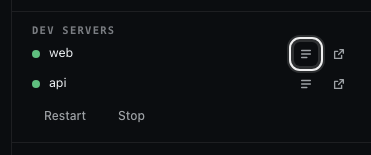

The logs icon opens that server's log in a window with a tab for each server. It follows new lines
every two seconds, marks error lines in red, and stays where you are when you scroll up. **Pause**
stops following, **Copy** takes the lines, and **Restart dev servers** restarts the worktree's
servers. Esc closes it.

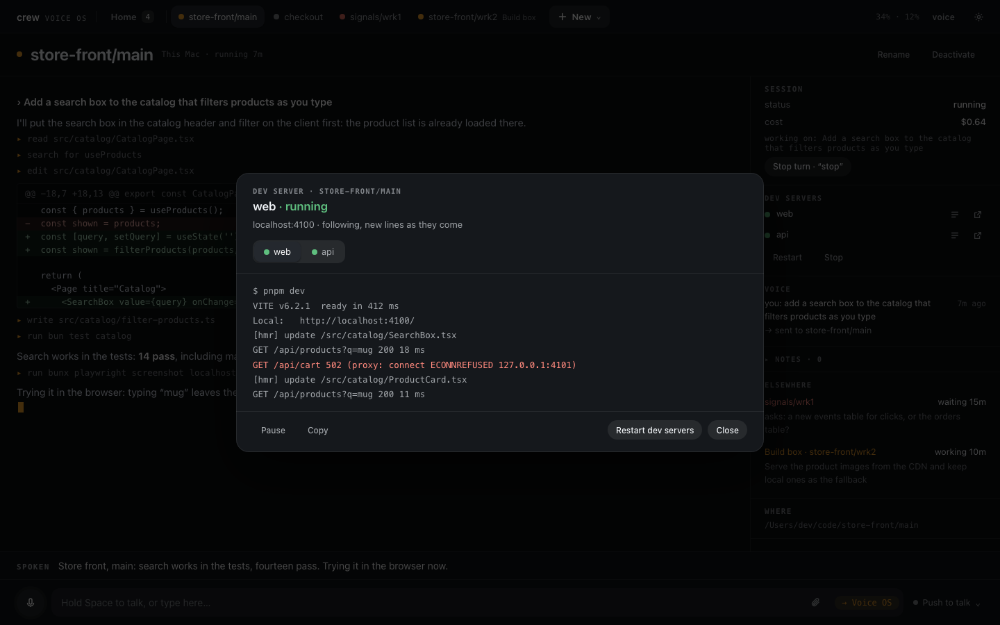

- "Start the dev servers." · "Restart them." · "Stop the servers."
- "What's wrong with the dev servers here?" Answered from what crew sees: which one died, and which
  never started listening.
- "Why were they failing? Check the logs." That is work, so it goes to the session, which reads
  them with `crew dev logs`.

When a server dies after a start, Voice OS says so and asks whether Claude should fix it. Say
"yes" (or click **Fix …**) to hand that worktree's session the failure, with its log.

## Notes and debug notes

**Notes** are your own ideas and reminders, said out loud. Voice OS keeps them per workspace in a
plain Markdown file.

- "Note: try a different tone per session." Saved to the workspace on screen. Off a session's screen it
  goes to your general notes. Voice OS replies "Noted."
- "Note for store front: check the image sizes." Saved to that workspace.
- "What are my notes?" · "Read my store front notes." Reads them back briefly.
- "Go through my notes and pick one to build next." That is work: the session reads the file
  itself.

The notes panel on the page shows them. The files are `~/.crew/voiceos/notes/<workspace>.md`, and
general notes go in `_general.md`. A workspace's notes are shared by every machine.

**Debug notes** are for when Voice OS itself gets something wrong: it misheard, sent your words to
the wrong session, or talked at the wrong moment.

- "Debug note: it read out every option when I only wanted the question."
- "Add a note that I get double speech when a plan opens." Voice OS saves this as a debug note,
  even without the word "debug".

Each debug note is saved with a snapshot of the moment (what you said and what Voice OS did on that
screen, the sessions, what was waiting, what was said last) to
`~/.crew/voiceos/logs/debug-notes.jsonl`, next to the log. Include them if you report a bug.

Read both from a terminal, or have an agent read them:

- `crew server notes store-front` · `crew server notes` (general) · `crew server notes --all`
- `crew server debug-notes` lists the debug notes, numbered; `crew server debug-notes show 3` prints
  one whole, then the log around it (`--around=2m` for more).

Notes and debug notes live on the main. On a remote these commands ask the main through the link.

## Other machines

One Voice OS can drive the sessions on other machines too, such as a VM or a second computer, over
SSH. You keep talking to the Voice OS on your own machine (the **main**). The other machine (a
**remote**) runs its sessions and nothing else: no page, no keys, no voice.
[Running crew on a remote VM](remote-vm.md) sets one up from nothing.

1. **On the other machine:** install crew, then run `crew server remote`. It checks tmux and Claude
   Code, installs Voice OS and starts it in the background. Sign in to Claude Code there once.
2. **Check SSH:** from your machine, `ssh <host>` must log in with no password prompt (your key or
   ssh-agent, and the host key accepted once). Voice OS connects with `BatchMode=yes`, so it cannot
   answer a prompt. How the host is reached is up to you: the LAN, a VPN, or an alias in
   `~/.ssh/config`.
3. **On your machine:** `crew server machines add store-vm --name="Build box"`, or add it in Set up
   (or Voice OS's Settings).

Activate then lists the machine's worktrees under its name, with what runs there and what waits on
you; its active sessions get tabs like this Mac's. Say its name to see its worktrees on Activate.

- "Show me Build box." · "Switch to the personal server." · "Go to this Mac."
- "Rename store-vm to Build box." You can also rename it in Settings, or run
  `crew server machines rename store-vm "Build box"`. A machine's id comes from its SSH host
  (`store-vm` here); its name is what you call it aloud.
- "Build box store front main, run the tests." If a session name exists on two machines, it means
  the one on the machine you are looking at. Name the machine to reach the other one: "store front
  main on this Mac".
- Its dev servers are its own. "Start the dev servers" works as it does here, and the links are
  that machine's addresses.
- Alerts from every machine play with the machine's name in front ("Build box, store front main
  needs you"), and switching to a machine tells you what is waiting there.

When the link drops, the sessions there keep working. Activate shows the machine as **out of
reach** and why, and a session page on it says it is reconnecting. What you say to it waits and is sent when it is back, and you hear one line about
what happened meanwhile ("Build box is back: store front main finished").

Each time the link connects, the machine's sessions are matched to the active set: active ones
that are stopped start, and inactive ones still running are stopped ("Stopped 3 sessions on Build
box that aren't active"). A deactivate you made while it was out of reach lands then. The machine's
setup session is left running: Set up's chat for that machine talks to it.

A machine is either a main or a remote, never both: `crew server` refuses on a remote, and
`crew server remote` refuses on a main. Removing it in Settings (or `crew server machines rm <id>`)
stops driving a machine. Its sessions keep running there.


### Trying a branch on every machine

A remote only talks to a main on the same version, so a build from source can't meet your remotes
until it's released. `crew server dev push`, run in a crew checkout on any machine — the main or a
remote — builds that checkout's crew and Voice OS for each kind of machine you have, then puts the
same build everywhere and restarts every machine, the one you pushed from last. It runs on its own,
so it keeps going while Voice OS and your Claude session restart; `crew server dev status` shows each
machine's progress. If any copy fails, nothing is installed. `crew update` on a machine takes it back
to the release.

## Running Voice OS

| Command | What it does |
| --- | --- |
| `crew` | Starts crew's server (Set up and Voice OS) if it is not answering and opens the page, or prints the link with no browser. Safe to run any time. |
| `crew server` | Prints the server's status. |
| `crew server start` | Starts it if needed and prints the sign-in links; asks for missing keys at a terminal. |
| `crew server restart` | Stops and starts it. Use it after `crew update`; a key needs no restart. |
| `crew server stop` | Stops Voice OS **and every Claude session it runs**. Their conversations resume the next time each session starts. |
| `crew server status` | Prints `up`, `up (not answering)` or `down`, with the port and both links. |
| `crew server logs [--since=…] [--level=…] [--machine=…]` | The log of every machine, filtered and merged by time (80 lines by default). See [Reading the log](#troubleshooting). |
| `crew server debug-notes [show <n>]` | Lists your debug notes, or prints one with the log around it. |
| `crew server notes [<workspace>\|--all]` | Prints your notes. |
| `crew server keys` | Shows which keys are set and where (never their values). |
| `crew server keys set <anthropic\|soniox>` | Sets a key from stdin, for example `pbpaste \| crew server keys set soniox`. |
| `crew server machines [ls\|add\|rm\|rename]` | Manages the other machines. |
| `crew server remote [status\|stop]` | Makes this machine a remote, or reports or stops it. |

Add `--no-open` to `start` or `restart` to skip opening the browser. `--json` gives
machine-readable output. [Every crew command](../commands.md#crew-voice) has the details.

**A restart keeps your place.** Voice OS remembers the screen you were on and returns to it. For
another machine's session, it waits up to a minute for that machine to reconnect. Open pages
reconnect by themselves, and the first one to reconnect hears "Voice OS restarted." Session streams
are rebuilt from Claude Code's own transcripts. Active sessions start again and resume their
conversations, another machine's once its link is up; nothing resumes mid-task, so they sit idle
until you speak to them. Inactive sessions stay stopped.

> A restart ends every running Claude session, even one that is in the middle of work. `crew kill`
> and `crew dev stop` without a workspace name stop dev servers only: the server runs in its own
> tmux session (`crew-server`), which they leave alone.

**Updating.** `crew update` also updates Voice OS to the matching version, but never restarts it,
because that would end your sessions. It says so when an update is waiting. Run
`crew server restart` when you are ready. A remote picks up the new version on its next connect,
at once; a session at work there is cut off and resumes on the new release. You don't have to update a remote yourself: when one runs an
older release than this Voice OS, Voice OS runs `crew update` there over SSH and reconnects; Settings
says "Updating …" while that runs, and Set up shows a command that machine's crew can't run yet as
"Build box runs crew X — it updates from this Mac". A remote on a *newer* release is never
downgraded; Settings tells you to update this machine instead.

## Where state lives

| Path | What |
| --- | --- |
| `~/.config/crew-voiceos/anthropic.key`, `soniox.key` | The API keys, readable by you only (0600). |
| `~/.crew/bin/voiceos` | The Voice OS binary, with a `.version` stamp beside it. |
| `~/.crew/voiceos/token` | The sign-in token (0600). Deleting it and restarting signs every browser out. |
| `~/.crew/voiceos/state.json` | The port and pid crew tracks, and each machine's last status. |
| `~/.crew/voiceos/sessions.json` | Which Claude Code conversation each session resumes. There is no time limit: a session keeps its conversation until you clear it or Claude Code no longer has it. |
| `~/.crew/voiceos/view.json` | The screen you were on, restored after a restart (one saved by an earlier release opens as Active, or Activate for a machine's grid). |
| `~/.crew/voiceos/voice-off.json` | Whether voice is off (the top bar's **voice**). |
| `~/.crew/voiceos/active.json`, `names.json`, `modes.json` | Your active sessions, session names and each session's permission mode. An older `pinned.json` is read once, when `active.json` does not exist yet. |
| `~/.crew/voiceos/journal/` | One file per session of what was asked and done in each turn, used for "what did checkout do yesterday". |
| `~/.crew/voiceos/notes/` | Your notes, one Markdown file per workspace. |
| `~/.crew/voiceos/media/` | Images sessions showed, kept for 30 days. |
| `~/.crew/voiceos/attachments/` | Files you attached, kept for 30 days. |
| `~/.crew/voiceos/machines.json` | The other machines. |
| `~/.crew/voiceos/logs/voiceos.log` | The log, rotated into `.1` … `.5` (`crew server logs`). |
| `~/.crew/voiceos/logs/debug-notes.jsonl` | Debug notes (`crew server debug-notes`). |
| `~/.crew/voiceos/remote/` | A remote's own daemon state, socket and log. |

The conversations themselves are Claude Code's, stored where Claude Code keeps them.

## Troubleshooting

**The page says "Microphone blocked."** Allow the microphone for the page in the browser's site
settings. Remember that browsers give the microphone only to `localhost` or HTTPS pages: on
another device, use the HTTPS proxy link after `crew dev proxy trust` on that device. On macOS,
also check System Settings → Privacy & Security → Microphone for your browser.

**A banner says voice is off until keys are set.** Set them in Voice OS's Settings, or run
`crew server keys` to see which key is missing and set it with
`crew server keys set <anthropic|soniox>`: Voice OS picks it up without a restart. If the
service rejects a key, check it in the Anthropic or Soniox console. Keys belong in the key files,
not in your shell: an exported `ANTHROPIC_API_KEY` would also switch your own Claude Code to
per-token billing.

**A session never starts, or stops at once with an error.** Usually Claude Code is not signed in
on this machine: sessions run on your Claude Code login, and Voice OS removes `ANTHROPIC_API_KEY`
from their environment, so a key in your shell does not count. The page shows Claude Code's own
error, as a **Stopped: …** line or as the session's reply. Run `claude` once in a terminal, sign
in, then send the session something again.

**Holding Space does nothing.** Space talks only in push to talk, and not while the cursor is in
a text field: click outside the input first. In on demand or hands-free there is nothing to hold;
switch back to push to talk from the menu by the mic. If the mic never starts, check the
microphone permission ("Microphone blocked" above).

**"This browser has no Voice OS session."** The sign-in cookie is missing. Run `crew server` and
open the link it prints.

**`crew server status` says `up (not answering)`.** The tmux session exists but Voice OS does not
answer. Run `crew server` to relaunch it, and `crew server logs` to see why it stopped answering.

**"Voice OS needs a few things first."** tmux or `claude` is missing, or not on the PATH of the
shell you ran crew from. Install what it names (`crew doctor --install`), or point
`VOICEOS_CLAUDE_BIN` at your `claude`.

**"Reconnecting to the Voice OS server…"** The page lost its connection, usually because Voice OS
restarted or stopped. It reconnects by itself. If it doesn't, run `crew server status`.

**A machine says "out of reach" or "needs a fix"** (on its page, in Settings, or in Set up's machine
picker). It shows the reason. The common ones:

| It says | Fix |
| --- | --- |
| Its host key is not trusted yet | Run `ssh <host>` once in a terminal and accept the key. |
| SSH refused the login | Check your key and that ssh-agent has it (`ssh-add -l`). |
| crew is not installed there | Install crew on that machine, then run `crew server remote`. |
| Its Voice OS did not start | Run `crew server remote` there, then `crew server remote status`. |
| Missing on that machine: tmux, claude | Install them there (`crew doctor --install`). |
| That machine runs Voice OS as a main | Run `crew server stop` there, then `crew server remote`. |
| Host … not found | Check the host name or your `~/.ssh/config` alias. |

**The mic stops on a phone.** Phones pause the microphone when the tab goes to the background or
the screen locks. Bring the tab back. Push to talk is the most reliable mode on a phone.

**It misheard or did the wrong thing.** Say "debug note: …" right away. Then
`crew server debug-notes` finds it and `crew server debug-notes show <n>` prints it with the log
around it. `crew debug --tail=20` shows what crew itself ran (starts, stops, key checks).

**Reading the log.** `crew server logs` reads the log of every machine at once and merges it by
time, newest 80 lines. Narrow it down:

- `--since=10m`, `--since=10:02 --until=10:05`, or an ISO time. Times are yours; crew converts
  them for every machine.
- `--level=warn` (warn and error), `--cat=router,kernel`, `--grep=signals` (any case).
- `--machine=vm1` or `--exclude=vm2`; `--machine=main` reads the main alone, without SSH.
- `--lines=200` for more, `--json` for a document.

On the main, crew asks each remote over SSH, even while Voice OS is down. A machine that does not
answer is named on stderr (`! vm2 (build box) unreachable: …`) and the others still print. One on
an older crew says `run crew update there`. On a remote, crew asks the main through the link; with
the main away you get that machine's own log and a warning. The log rotates at 20 MB and keeps
five older files (`voiceos.log.1` … `.5`); `crew server logs` reads them all.

## Privacy and cost

**What leaves your machine:**

- **Audio** goes to Soniox for speech-to-text while you talk (for as long as listening is on in the
  always-listening modes), and Voice OS's spoken lines go to Soniox to be turned into speech.
- **Text** goes to the Anthropic API, using your key. The kernel gets what you said, together with
  a summary of the sessions (their status, what you asked them, what is waiting, their recent lines). After a
  turn, the session's final message goes to the narrator when it has no spoken line. To word its own
  short lines, Voice OS sends Haiku only what the line says (a session's name, whether a switch is
  offered), never a command or a path.
- **Your Claude Code sessions** talk to Anthropic as Claude Code always does, on your login. When
  one session asks another, the copy that answers is a short Claude Code run of its own on the same
  login. See [Sessions asking each other](#sessions-asking-each-other).

**What stays on your machine:** everything under `~/.crew/voiceos/` (see
[Where state lives](#where-state-lives)). The log records what you said and where it went, so treat
it as private. Voice OS does not record audio. The one exception is a contributor debug switch
(`VOICEOS_DEBUG_AUDIO=1`, see the [Voice OS README](../../voiceos/README.md)), which is off unless
you run Voice OS from source with it set.

**Who can open the page:** Voice OS listens on `127.0.0.1` only. Other devices reach it through
crew's dev proxy, and every request needs the sign-in cookie, which is set only by the link that
carries your token.

**Cost:**

- **Claude Code sessions** use your Claude plan like any other Claude Code session. The top bar
  shows your usage. Each session page shows a cost: the figure Claude Code reports for the
  session's turns. On a Claude subscription that is an API-price estimate, not a bill.
- **The kernel** (Claude Haiku) handles every spoken turn, and every typed one that does not go
  straight to a session. **The narrator** (Claude Sonnet) summarizes a turn only when a session's
  final message has no spoken line of its own. When a session asks you something, a short Haiku call names what
  the question is about. All of them bill your Anthropic key. A spoken turn costs the kernel roughly a third of a
  cent. The language check (Haiku, see [Languages](#languages)) runs only on turns where Voice OS
  acts on what you meant, and costs a small fraction of that. Wording Voice OS's own short lines
  (Haiku) costs a small fraction of a cent each.
- **Soniox** bills audio: speech-to-text for as long as the microphone streams, and text-to-speech
  for what Voice OS says ([Soniox pricing](https://soniox.com/pricing)). On demand and hands-free stream the whole time listening is on. Push to
  talk streams only while you hold the key.

More: [how crew works](../concepts.md) · [every crew command](../commands.md) ·
[running crew on a remote VM](remote-vm.md) · [how Voice OS is built](../../voiceos/README.md)
