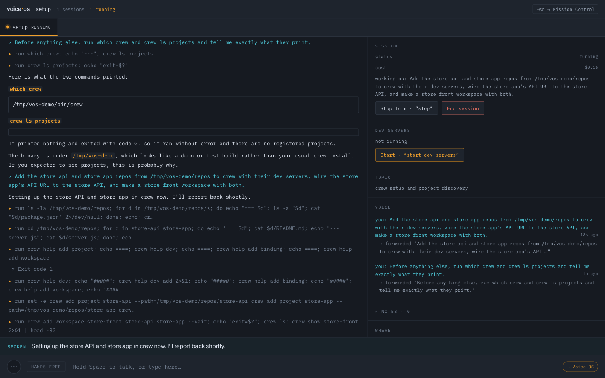
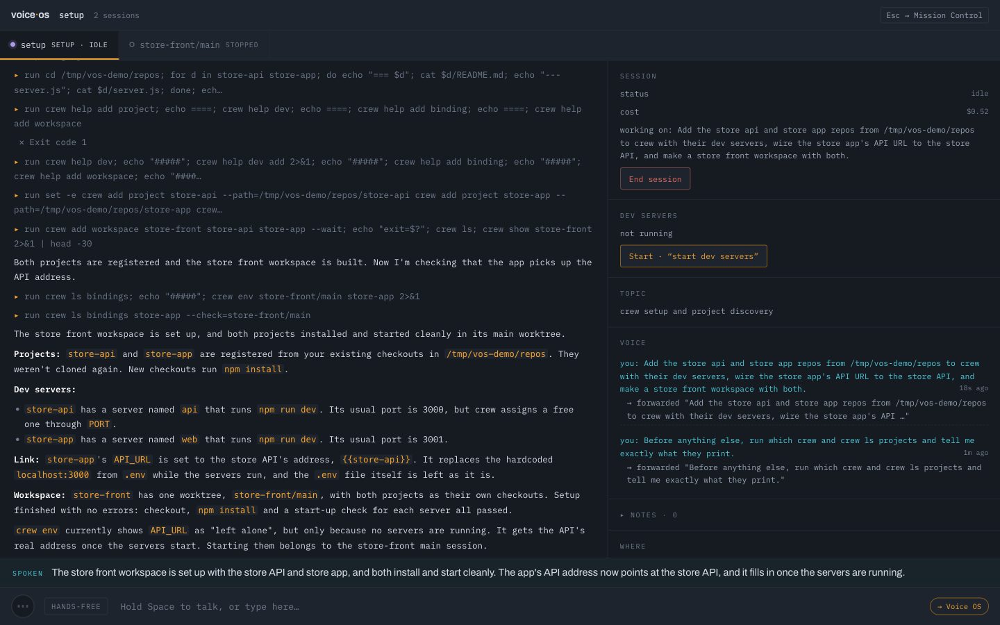
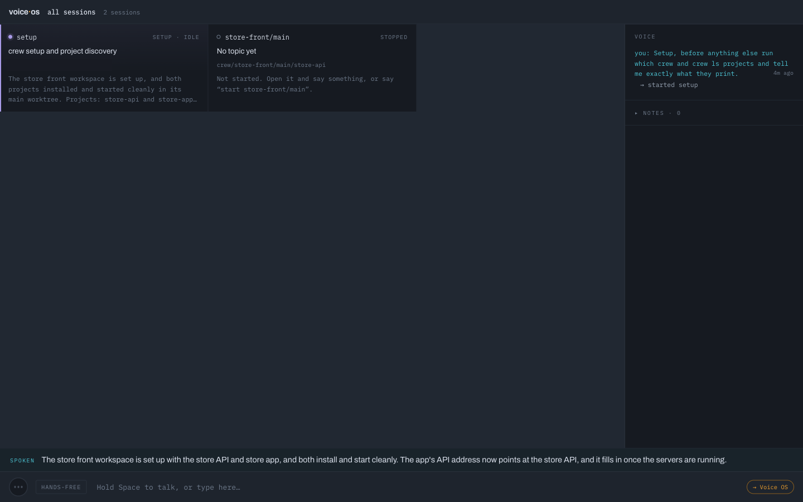
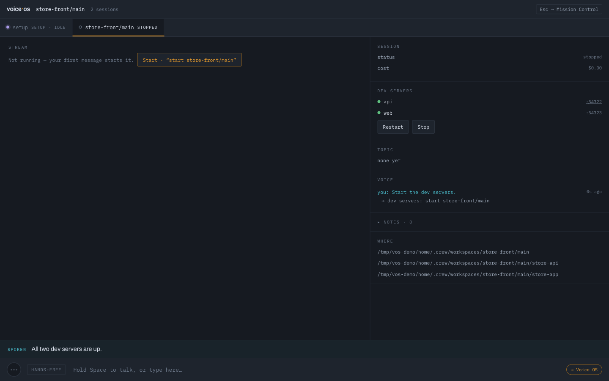
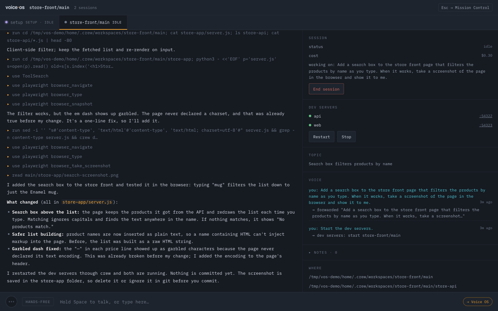
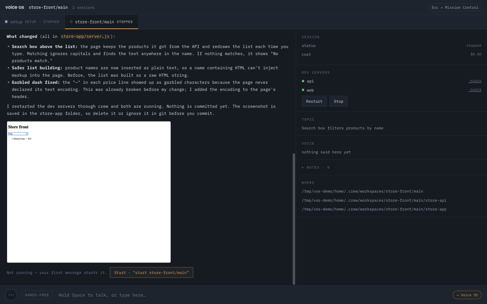
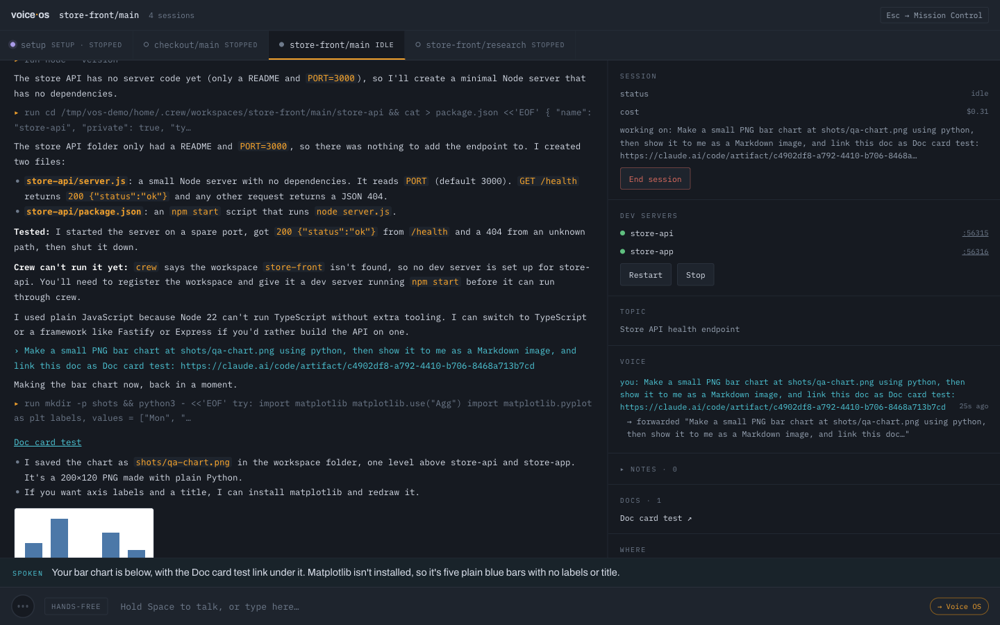
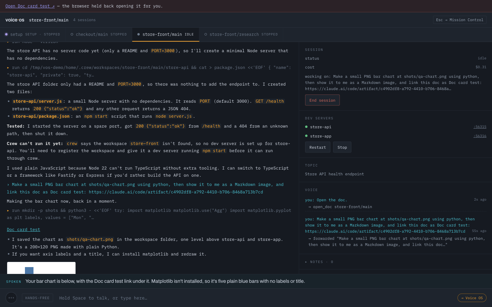

# Voice OS: talking to your sessions

Voice OS runs one Claude Code session per worktree and lets you drive all of them by voice (or by
typing in the bar at the bottom). You talk; a small router decides where your words go. Most of
the time that is simply the session on your screen.

```bash
crew voice      # first run: checks tmux and Claude Code, downloads Voice OS, asks for its two keys
```

Open the link it prints. **Hold Space** to talk, or pick another listening mode (below). **Esc**
goes back to Mission Control, where every session is on one screen.

## From two repos to a working feature

Everything below happened by voice (the words in quotes are what was said), on two small repos: a
store API that serves products, and a store front page that lists them from `API_URL`.

**1. Ask the setup session.** "Add the store api and store app repos from ~/code to crew with their
dev servers, wire the store app's API URL to the store API, and make a store front workspace with
both." The setup session runs crew for you: it reads each repo, registers it, and works out how its
dev server starts.



**2. It reports back.** Both projects are registered with their dev servers (`npm run dev`, on a port
crew picks), the store front's `API_URL` is bound to the store API, and a fresh copy of both was
installed and started once to prove it works. You hear the summary; the details are on the page.



**3. The new worktree appears.** store-front/main shows up on Mission Control by itself, ready to
open.



**4. Open it and start its servers.** "Open store front main." "Start the dev servers." Both come up
on this copy's own ports, and Voice OS says so.



**5. Build something.** "Add a search box to the store front page that filters the products by name
as you type. When it works, take a screenshot of the page in the browser and show it to me." The
session writes the code, restarts the servers through crew, tries it in a browser, and fixes what
it finds on the way.



**6. See the result where you are.** Its screenshot shows in the session's page — served by Voice OS
itself, so it shows on your phone too.



## What a session shows you

A screenshot, chart or diagram a session makes shows inline in its page. Docs and artifacts it
writes — Claude Docs, Google Docs, Notion — become cards, and a **Docs** list per session keeps
them together.



"Open the doc" opens the session's newest doc — or "open the risks doc" the one you name — in the
browser you're using. When the browser holds back a new tab (a phone usually does), a banner offers
it to tap.



"Add a section on the rollout risks to the doc" goes to the session, which edits the doc itself.

The examples below are the kind of thing people actually say — filler, restarts and all. You
don't need to phrase anything carefully.

## Talk to the session in front of you

Anything about the work goes straight to the session on screen, in your words: instructions,
questions, reactions, half-formed thoughts.

- "Hmm, I don't like that. Revert the last change."
- "Why is this so slow?"
- "Okay, the retry works but it's too aggressive. Cap it at three attempts and log each one."
- "Can you check the transcripts for the chat and let me know?"
- "Could we brainstorm a bit? Maybe let's use proxy brainstorm."
- "Where is the other code at? Which branch?"
- "What's the last thing we've done?" — the session remembers its own conversation.

Relay words are dropped ("can you ask it to…" becomes the request itself), and everything else is
kept: names, numbers, negations, the skill you named. Voice OS doesn't answer these itself and
doesn't ask you what you meant — the session can ask back if it needs to.

If a session is busy, a question goes to it on the side and is answered without stopping the
work; an instruction waits in its queue until the current work is done.

## Answer what a session is waiting on

When a session asks for permission, shows a plan, or asks you a question, you hear it — and answer
it the way you'd answer a person:

- "Yes." · "Go ahead." · "Always." (allow it and don't ask again)
- "No, use a new branch." — declined, and your reason reaches the session.
- "Yes, but push to a new branch afterwards." — approved, with a note.
- "The second one." · "Reuse orders." — picks an option by position or by name.
- "Options." — reads the choices out again.
- "Why does step three touch the kernel?" — asks about the plan without answering it; the plan
  keeps waiting.

Saying something else entirely ("actually, let's look at the router first") moves on: your words
go to the session and the question is set aside.

## Work with several sessions

- "Open the checkout one." · "Show me the locale work." · "Switch back to store front main." —
  sessions can be named by their worktree or by what they're working on.
- "Tell checkout to add backoff to the webhook retries." — sends work to another session without
  leaving the one you're in.
- "Checkout, run the tests."
- "Take me back to Mission Control."

Sessions you aren't looking at don't talk over you. You hear a short line — "checkout is done", or
"checkout needs you: the backoff cap" with a chime — and the full message plays when you switch
there. A very short answer is still said wherever you are.

## Ask what's going on

- "Is anything waiting on me?"
- "How's checkout doing?"
- "What's the ranking work doing?"
- "What did the session say?" — reads its last reply back, with any choice it left you.

## Start, stop, interrupt

- "Start the checkout retry one." · "Start checkout and tell me what it did last." — starts the
  session and sends it the rest.
- "End the checkout session."
- "Stop." · "Wait." — interrupts the session on screen while it's working.
- "Actually, stop the refactor and fix the login bug first." — Voice OS asks whether to stop the
  current work and switch.

## Change your mind

- "Take that back." · "Don't send that." — pulls back words that are still queued.
- "Why are you queuing it? I want it right now." — sends the queued message now.
- "Sorry, I meant that for store front main." — sends it there instead and takes it back from the
  wrong session.

## Dev servers

Voice OS starts, stops and watches each worktree's dev servers (crew keeps them on that
worktree's own ports).

- "Start the dev servers." · "Restart them." · "Stop the servers."
- "What's wrong with the dev servers here?" — answered from what crew sees: which one died, which
  never started listening.
- "Why were they failing before? Could you check the logs?" — that's work, so it goes to the
  session, which reads the logs with `crew dev logs`.

When a server dies after a start, Voice OS says so and asks whether Claude should fix it. "Yes"
hands that worktree's session the failure with its log.

## New workspaces and worktrees

The pinned **setup** session runs crew itself (see the walkthrough above). Ask it from anywhere:

- "Setup, make a worktree in store front for the search fix."
- "Create a new worktree for the search fix."
- "Delete the checkout worktree." — it asks before anything destructive.

## Notes

- "Note: try a different tone per session." — your own idea, kept per workspace.
- "What are my notes?"
- "Go through my notes and pick one to build next." — the session reads them and works from them.
- "Add a debug note: it read out every option when I only wanted the question." — for when Voice
  OS itself gets something wrong; saved with a snapshot of the moment.

## Voice and listening

- "Quiet." — stops Voice OS talking.
- The menu next to the mic picks how Voice OS listens:
  - **Push to talk** — hold Space or the mic button.
  - **On demand** — always listening, but only what you say after "Voice OS" is taken: "Voice OS,
    tell checkout to run the tests." The turn ends with your sentence, or at once when you say "end
    of turn"; a second sentence needs "Voice OS" again. A chime says it heard its name, and the
    input shows "Listening to you" until the turn goes. With the TV on, say the name and the
    command in one breath: a pause after "Voice OS" lets whatever is said next in. The TV and people around you are left alone until someone says its name — answers too
    ("Voice OS, yes").
  - **Hands-free** — always listening, every sentence is a turn.
  
  Both listening modes stream the mic to Soniox the whole time the page is open, so they cost the
  same. Phones may stop the mic when the tab is in the background.
- "Switch to on demand." · "Turn off hands-free." · "Turn hands-free back on." · "Push to talk."
- "End of turn." — sends what you said now, in either listening mode, without waiting for the pause.
- Background talk, music and a half-finished "and can you—" are ignored, and nothing is said about
  it.

## Keys and cost

Voice OS needs an Anthropic key (for the router and the spoken summaries) and a Soniox key (speech
in and out). The first `crew voice` asks for both and checks them; `crew voice keys` shows which
are set. Your Claude sessions themselves run on your own Claude Code login. A spoken turn costs
the router about a third of a cent.

More: [how Voice OS is built](../../voiceos/README.md) · [every crew command](../commands.md)
