# Crew VM Setup Guide

Complete setup for running Crew on a GCP VM with Claude Code, dev servers, and remote editor access.

---

## 1. SSH Access

On your **local machine**, generate a key and register it with your VM:

```bash
ssh-keygen -t ed25519 -C "jsmith" -f ~/.ssh/speak_dev_vm

echo "jsmith:$(cat ~/.ssh/speak_dev_vm.pub)" > /tmp/ssh-keys.txt
gcloud compute instances add-metadata jsmith-dev-vm \
  --metadata-from-file=ssh-keys=/tmp/ssh-keys.txt \
  --project=speak-2-dev-vms --zone=us-west1-b
rm /tmp/ssh-keys.txt
```

> Replace `jsmith` with your username, `jsmith-dev-vm` with your VM name, and update the project/zone to match your GCP setup.

Add to `~/.ssh/config`:

```
Host speak-vm
  HostName jsmith-dev-vm
  User jsmith
  IdentityFile ~/.ssh/speak_dev_vm
  ProxyCommand gcloud compute start-iap-tunnel %h %p --listen-on-stdin --project=speak-2-dev-vms --zone=us-west1-b
```

Verify the connection:

```bash
ssh speak-vm
```

---

## 2. Install Crew

On the **VM**:

```bash
curl -fsSL https://raw.githubusercontent.com/FurlanLuka/crew/main/install.sh | sh
echo 'export PATH="$HOME/.local/bin:$PATH"' >> ~/.bashrc && source ~/.bashrc
```

Authenticate GitHub and log into Claude:

```bash
gh auth login
claude login
```

---

## 3. Clone Projects

```bash
gh repo clone your-org/speak-api ~/projects/speak-api
gh repo clone your-org/speak-partner ~/projects/speak-partner
```

> Replace with your actual org and project names.

Install dependencies for each project (e.g. `cd ~/projects/speak-api && npm install`).

---

## 4. Set Up Crew

Run `crew` to open the main menu:

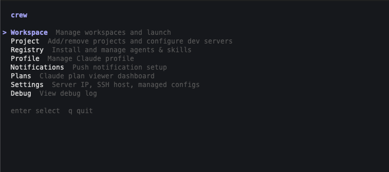

### Register projects

Navigate to **Project** and press **a** to add a project. Enter the path and name:

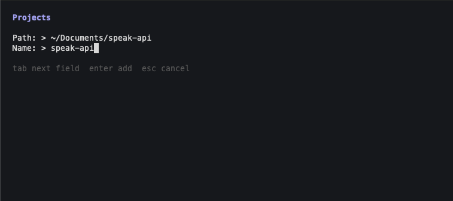

Your projects will appear in the list:

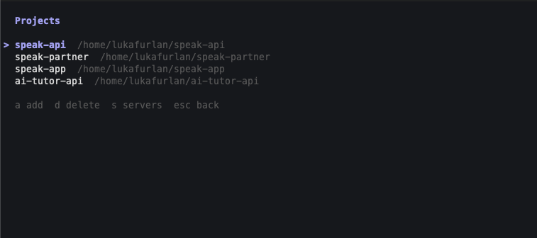

Select a project and press **s** to configure its dev servers — set the name, port, and start command:

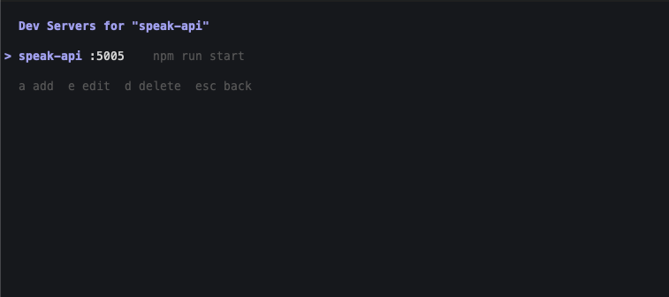

Repeat for each project.

### Create a workspace

Navigate to **Workspace** and press **n** to create a new workspace:

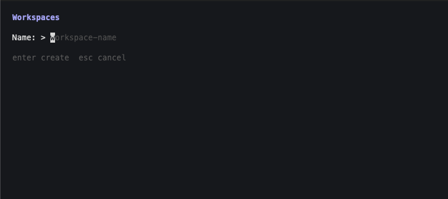

Then press **p** to select which projects to include.

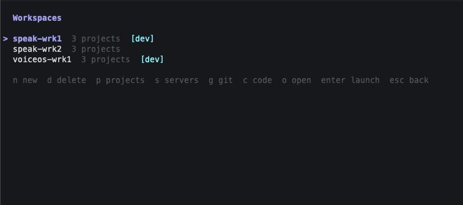

Workspaces with running dev servers show a **[dev]** badge.

### Configure settings

Navigate to **Settings** and press **e** to edit:

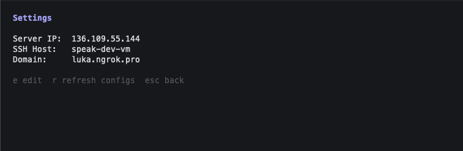

- **Server IP** — auto-detected, override if needed
- **SSH Host** — your SSH config host name (e.g. `speak-vm`) — used by `crew code`
- **Domain** — your ngrok domain (e.g. `jsmith-dev.ngrok.app`) — set after step 5

To use ngrok on port 80, set the proxy port in the config file directly:

```bash
# ~/.claude-personal/settings.json (or ~/.claude/settings.json)
{ "domain": "jsmith-dev.ngrok.app", "ssh_host": "speak-vm", "proxy_port": 80 }
```

---

## 5. Public Access

Dev servers are accessible at `http://{server}--{workspace}.{vm-ip}.nip.io:{port}` without any extra setup. However, services that use Firebase Auth will block requests from `.nip.io` domains since they're not in the authorized domains list.

### ngrok (recommended)

ngrok gives you a stable domain that you can whitelist in Firebase.

Reserve a wildcard domain on [dashboard.ngrok.com](https://dashboard.ngrok.com) (e.g. `*.jsmith-dev.ngrok.app`), then run in a detached tmux session:

```bash
tmux new -s ngrok
ngrok http 80 --url=jsmith-dev.ngrok.app
# Ctrl+B D to detach
```

> Replace `jsmith-dev.ngrok.app` with your reserved domain.

Go back to **Settings** in crew and set **Domain** to your ngrok domain.

### Firebase Auth

Add your ngrok domain to Firebase's authorized domains so auth flows work:

1. Open [Firebase Console](https://console.firebase.google.com) → your project → Authentication → Settings
2. Under **Authorized domains**, add `jsmith-dev.ngrok.app`

---

## 6. Using Crew

Everything below is done from the **Workspace** screen (`crew` → **Workspace**).

### Start dev servers

Select a workspace and press **s** to start dev servers. Press **l** to open the live log viewer.

Each server gets its own tab — switch with **tab**, restart with **r**, scroll with arrow keys:

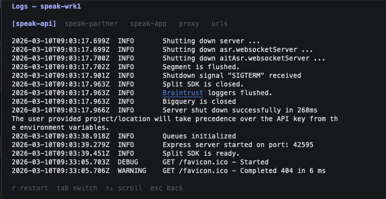

The **urls** tab shows all service URLs for the current workspace, plus any other running workspaces:

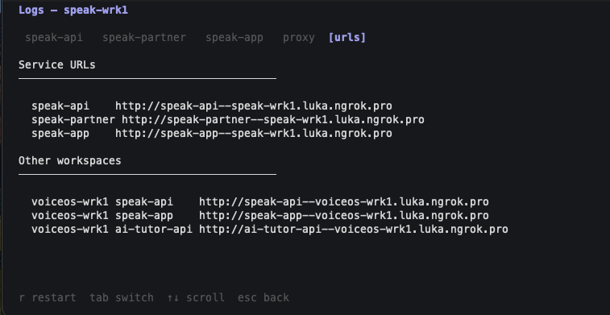

### Launch Claude

Select a workspace and press **enter** to launch. Pick a mode:

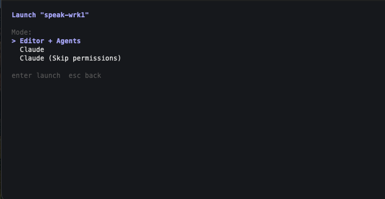

- **Editor + Agents** — opens your editor and starts Claude agents
- **Claude** — starts Claude Code in a tmux session
- **Claude (Skip permissions)** — same, with auto-accept enabled

### Open in Cursor / VS Code

Select a workspace and press **c**, or from the CLI:

```bash
crew code my-workspace
```

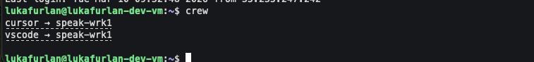

Prints clickable links that open the workspace in Cursor or VS Code via Remote-SSH. You can also connect manually: `Remote-SSH: Connect to Host` → `speak-vm`.

### Git (lazygit)

Select a workspace and press **g** to open lazygit in a tmux session with a tab per project.

---

## Optional: Install Agents & Skills

Crew ships with a registry of reusable Claude Code agents and skills (code reviewers, PR reviewer, web designer, etc.). These are optional — Crew works fine without them.

From the main menu, navigate to **Registry**:

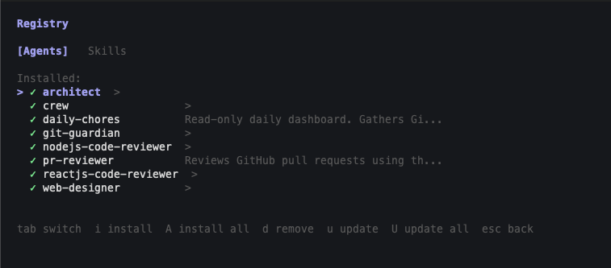

Use **tab** to switch between Agents and Skills, **i** to install, **d** to remove, **u** to update.

Or install everything at once from the CLI:

```bash
crew registry install --all
```
